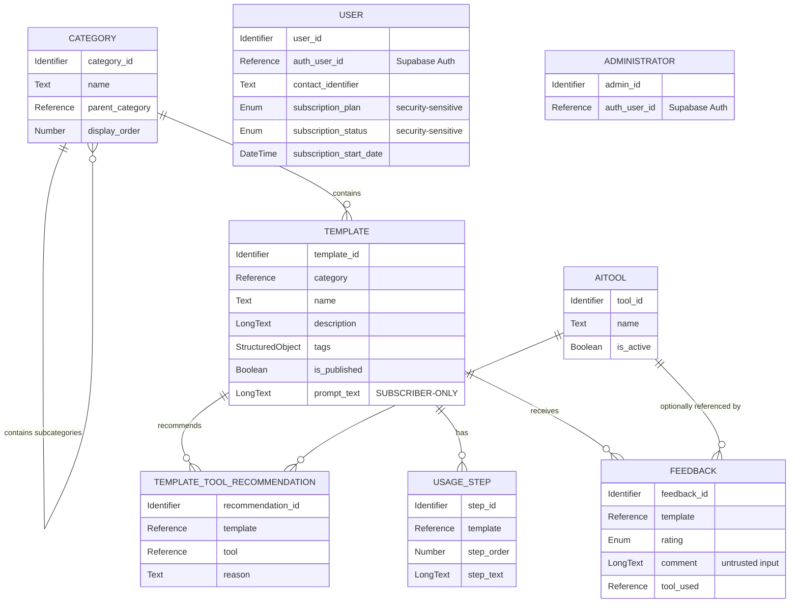

# AWA — MVP Database Definition

**Status:** Data-definition stage. No database technology, vendor, API, or application architecture is selected here, except where the confirmed use of Supabase Auth (per the architecture and Security Review) determines how identity is *referenced*, not how it is implemented.
**Sources of truth:** `01-PROBLEM.md`, `02-USER-RESEARCH.md`, `03-REQUIREMENTS.md`, `04-FEATURES.md`, `05-MVP.md`, `06-ARCHITECTURE-DECISION.md`, `13-SECURITY-REVIEW.md`.
**Scope:** Only the 21-feature, 5-category, no-customization MVP defined in `05-MVP.md`, restricted to what `06-ARCHITECTURE-DECISION.md` §3 already confirmed as REQUIRED persistent data — now revised to explicitly model the security boundaries established in `13-SECURITY-REVIEW.md`. This document expands that confirmed list into a full conceptual data model; it does not re-open the REQUIRED/NOT REQUIRED decision itself.

```text
Problem → User Need → Requirement → Feature → MVP → Persistent Data (this document) → Security Boundaries (13-SECURITY-REVIEW.md)
```

**Core principle governing this revision:**

> Data stored in the same entity does not necessarily share one visibility level. Access must be defined at the resource level *and* the field level. A `Template` record, for example, mixes public discovery information with protected, subscriber-only information — the entity itself is neither simply "public" nor simply "private."

---

## Database Decision

DATABASE: REQUIRED

### Reason

`06-ARCHITECTURE-DECISION.md` §3 (Persistent Database) already confirms a database is REQUIRED for the MVP: catalog content (categories, templates, prompt text), the AI tool/model master list, tool/model tag assignments, usage steps, subscription/account state, and feedback records must all outlive a single interaction, be shared across many users, and be editable by administrators without a code change (NFR-008). This document defines exactly what that persistent data model consists of, and — per `13-SECURITY-REVIEW.md` — exactly which parts of it may cross the server-to-client boundary and under what conditions.

---

## 0. Data Visibility Classification

Every piece of data in this model falls into exactly one of four conceptual visibility levels. These are access classifications, not necessarily database tables or columns — a single entity commonly contains fields at more than one level (see Section 4).

```text
PUBLIC
Available to anonymous users and authenticated users alike.

AUTHENTICATED / USER-PRIVATE
Available only to the authenticated owner of the data, or to another
explicitly authorized system actor (e.g., the application's own
access-control logic).

SUBSCRIBER-ONLY
Available only when the authenticated user currently holds an
active subscription.

ADMIN-ONLY
Available only to authorized administrators.
```

These four levels are the conceptual source of truth for every ownership, access, and security decision in the rest of this document. Section 18 (Data Access Matrix) applies them to every entity and field defined here.

---

## 1. Persistent Data Requirements

| Data | Why It Must Persist | Used By | Source Requirement | MVP Necessity | Visibility |
|---|---|---|---|---|---|
| Category/subcategory structure | Must exist and be editable by admins without a rebuild; browsing has nothing to show otherwise | FEAT-001 | FR-001, FR-035, NFR-008 | Required | PUBLIC |
| Template metadata (name, description, tags) | Must be readable by non-subscribers before they pay, and must persist identically for all users | FEAT-002, FEAT-004 | FR-002, FR-004, FR-036 | Required | PUBLIC |
| Template prompt text | The core deliverable; must be identical for every user until an admin changes it | FEAT-006 | FR-007, FR-036 | Required | SUBSCRIBER-ONLY |
| AI tool/model master list | Maintained over time as tools/models change or retire | FEAT-032 | FR-038 | Required | PUBLIC |
| Template → tool/model tag assignment + one-line reason | Powers the tool recommendation display | FEAT-017, FEAT-031 | FR-019, FR-037 | Required | PUBLIC |
| Written usage steps | Must be authored by admins and displayed to users | FEAT-018, FEAT-033 | FR-020, FR-039 | Required | PUBLIC |
| Subscriber account + subscription state | Must be recognized across many separate visits (plans are yearly/lifetime, not session-based) | FEAT-007, FEAT-008, FEAT-023, FEAT-024 | FR-008, FR-009, FR-027, FR-028 | Required | AUTHENTICATED / USER-PRIVATE (entitlement fields are security-sensitive — see Section 12) |
| Administrator account | A distinct, elevated identity is needed to gate content-management actions | FEAT-029–033, FEAT-038 | FR-035–FR-038 | Required | ADMIN-ONLY |
| Feedback (rating, optional comment, optional tool used) | Only evidence channel for MVP validation; must be reviewable by admins after the fact | FEAT-020, FEAT-021 | FR-022–FR-025 | Required | Mixed — see Section 21 (rating/tool_used are platform-managed; comment is sensitive free text) |

No other data type from the source material's example list (user-generated requirements, generated prompts, saved content, history) is included here — each is addressed explicitly in Sections 10, 24, and 26 below and either does not apply to this MVP or is deliberately excluded.

---

## 2. Persistent vs. Temporary vs. Static Data

### Persistent Data
Everything in Section 1 above: category structure, template content, the tool/model master list, tag assignments, usage steps, subscriber/admin accounts, subscription state, and feedback. Each survives past a single interaction, is shared across users, or is edited by admins independently of any one user's session.

### Session / Temporary Data
- **In-progress browsing/filter selections.** A user's current category/tag filter is ordinary session state; the MVP has no requirement to recall a user's last filter on a later visit.
- **The in-flight payment handshake.** `06-ARCHITECTURE-DECISION.md` §3 states this explicitly: "the *outcome* (an active subscription) is persisted; the transient checkout exchange itself is not AWA's data to keep." Whether a small set of verified payment references should persist alongside that outcome is a separate, still-open question — see Section 14.

### Static / Managed Content
Categories, templates, the tool/model master list, and usage steps are all **platform-managed content** — represented as persistent entities (because NFR-008 requires them to be admin-editable without a rebuild) but not user-specific; every user of a given template sees the same stored content until an admin changes it. Public visibility applies to their discovery fields; `Template.prompt_text` is the one field in this group that is not public (Section 4).

---

## 3. Entity Identification

## Entity: Category

### Purpose
Represents one node in AWA's browsable catalog hierarchy (a category or a subcategory at any depth).

### Why It Exists
FR-035 requires admins to create, edit, reorganize, and remove categories/subcategories to unlimited depth without developer involvement; FEAT-001 has nothing to display without this structure existing as data.

### Requirement Traceability
- FR-001, FR-035
- FEAT-001, FEAT-029

### Ownership
Platform-owned / Administrative.

### Visibility
PUBLIC (entire entity).

### Lifecycle
Created and edited by an administrator (FEAT-029); removed by an administrator; read by all users (anonymous browsing, FEAT-022) and by the application when resolving a template's location in the catalog.

---

## Entity: Template

### Purpose
Represents one selectable creation template: its description, filtering attributes, and finished, admin-authored prompt text.

### Why It Exists
FR-036 requires admins to author, edit, publish, and remove templates consisting of finished prompt text. FEAT-006 (the core value proposition) has no content without this entity; FEAT-002/FEAT-004 need its descriptive fields for pre-purchase evaluation.

### Requirement Traceability
- FR-002, FR-004, FR-005, FR-007, FR-036
- FEAT-002, FEAT-004, FEAT-006, FEAT-030

### Ownership
Platform-owned / Administrative.

### Visibility — Field-Level, Not Entity-Level
This entity is the clearest example of why visibility must be defined per field rather than per entity:

| Field | Visibility |
|---|---|
| template_id | PUBLIC |
| category | PUBLIC |
| name | PUBLIC |
| description | PUBLIC |
| tags | PUBLIC |
| is_published | INTERNAL / ADMIN-MANAGED |
| prompt_text | SUBSCRIBER-ONLY PROTECTED DATA |

`prompt_text` is AWA's premium content. It is never treated as "the whole Template, visually hidden" — it is a distinct, protected field that is either authorized for a given request or it is not.

### Lifecycle
Authored, edited, published, and removed by an administrator (FEAT-030). Read by all users for metadata/description (free, FEAT-002). The `prompt_text` field is resolved and returned by the server **only** when the requesting user's subscription status (see User entity, Section 12) is currently active. For a non-subscriber, `prompt_text` is not merely hidden by the UI — it must not be included in the server's response at all (see Section 11).

---

## Entity: AITool

### Purpose
Represents one entry in the master list of AI tools/models (e.g., "Runway Gen-3," "Sora," "Pika 1.5") that AWA can recommend.

### Why It Exists
FR-038 requires an admin-maintained master list, independent of any one template, since tools/models are added and retired over time.

### Requirement Traceability
- FR-038
- FEAT-032

### Ownership
Platform-owned / Administrative.

### Visibility
PUBLIC (entire entity).

### Lifecycle
Created and edited by an administrator; retired (not hard-deleted, per FR-038's "retiring entries" language) by an administrator so that existing historical assignments/feedback references remain valid. Read by all users wherever a recommendation is shown, and by admins when assigning tools to templates.

---

## Entity: TemplateToolRecommendation

### Purpose
Represents the assignment of one specific AI tool/model to one specific template, together with the one-line reason shown to users for that pairing.

### Why It Exists
FR-037 requires admins to tag a template with one or more tools/models it is written for; FR-019/FEAT-017 requires each recommended tool to carry its own one-line rationale, which is a property of the *pairing* (this template + this tool), not of either entity alone.

### Requirement Traceability
- FR-019, FR-037
- FEAT-017, FEAT-031

### Ownership
Platform-owned / Administrative.

### Visibility
PUBLIC (entire entity). Distinct from `Template.prompt_text` — recommending a tool and explaining why is discovery-supporting content, not the protected deliverable itself.

### Lifecycle
Created and edited by an administrator when assigning tools to a template; removed when an assignment is no longer accurate or when the underlying template/tool is removed/retired. Read by all users at the recommendation step (FEAT-017).

*Note on category-level inheritance:* FR-037 describes the ability to "assign once and have it inherit down the category tree." `06-ARCHITECTURE-DECISION.md` §3 confirms the data that FEAT-017 actually reads from is "tool/model tag assignments **per template**" — i.e., the resolved, template-level assignment is what must persist. Whether an admin *authored* that assignment directly on the template or via a category-level default is an authoring-workflow question, not a distinct data-persistence need, so no separate category-level tagging entity is introduced here (see Section 24, Excluded/Speculative Data).

---

## Entity: UsageStep

### Purpose
Represents one ordered, short instructional step for using a recommended tool with a given template's prompt.

### Why It Exists
FR-020/FR-039 (written-steps portion) requires admin-authored, tool-specific usage guidance to persist and display per template.

### Requirement Traceability
- FR-020, FR-039 (written steps only, per MVP scoping)
- FEAT-018, FEAT-033

### Ownership
Platform-owned / Administrative.

### Visibility
PUBLIC (entire entity).

### Lifecycle
Authored, edited, reordered, and removed by an administrator per template; read by all users at the guidance step (FEAT-018).

---

## Entity: User

### Purpose
Represents one subscriber account: the identity recognized across visits and the subscription state that gates full prompt access.

### Why It Exists
FR-027/FR-028 require that subscription entitlement be recognized on return visits (plans are yearly or lifetime, not per-session), which requires a persistent account, not just a session.

### Requirement Traceability
- FR-008, FR-009, FR-026, FR-027, FR-028
- FEAT-007, FEAT-008, FEAT-023, FEAT-024

### Ownership
User-owned (each record represents one person's own account), with entitlement fields treated as security-sensitive (see Section 12).

### Visibility
AUTHENTICATED / USER-PRIVATE for the record as a whole, read by the record's own owner. `subscription_status` and `subscription_plan` are additionally treated as **security-sensitive entitlement data** — see Section 12 — readable by the system's own access-control logic on every protected-content request, not just by the user.

### Identity Model — No Application-Owned Credentials
The confirmed architecture uses Supabase Auth. AWA's application database does not model raw passwords, password hashes, authentication tokens, or any other authentication credential as application-owned data. Authentication credentials belong to the authentication provider, not to AWA's own schema. The `User` entity instead holds `auth_user_id`, a reference to the identity already managed by Supabase Auth (see Section 4 for the revised field list).

### Lifecycle
Created when a person first registers/subscribes; subscription fields updated **only** by a trusted server-side process on independently verified payment confirmation (FEAT-024) or by an authorized administrative operation — never directly by the client (see Section 13). Read by the application on every protected-content request to resolve current entitlement (FR-008/FR-009), and by the user themself for their own account state. Deletion is not addressed anywhere in the source material (see Section 15, Retention: TBD).

---

## Entity: Administrator

### Purpose
Represents one platform/content-administrator identity, distinct from a subscriber, used to gate content-management actions.

### Why It Exists
`06-ARCHITECTURE-DECISION.md` §8 confirms admins need "a distinct, elevated identity," and FR-035–FR-038 require that only administrators can create/edit/remove catalog content.

### Requirement Traceability
- FR-035, FR-036, FR-037, FR-038
- FEAT-029, FEAT-030, FEAT-031, FEAT-032, FEAT-033, FEAT-038

### Ownership
Administrative.

### Visibility
ADMIN-ONLY (entire entity).

### Identity Model — No Application-Owned Credentials
As with `User`, no raw login credential is modeled here. `Administrator` holds `auth_user_id`, referencing the same Supabase Auth–managed identity, plus whatever minimal data is needed to represent administrator *authorization* — not administrator *authentication*. The underlying conceptual relationship is:

```text
Authenticated identity (Supabase Auth)
        ↓
Administrator authorization (AWA's own record/role)
```

not:

```text
AWA stores an administrator password/credential
```

### Provisioning Constraint
See Section 8. The first Administrator record must be created through a controlled, non-public mechanism; there must be no publicly reachable operation through which an ordinary authenticated user can create or promote themselves into an Administrator.

### Lifecycle
Provisioning mechanism is constrained per Section 8 but not fully specified in the source material. Read by the application to authorize content-management actions. Update/removal not specified (see Section 15, Retention: TBD).

---

## Entity: Feedback

### Purpose
Represents one submitted rating (and optional comment/tool-used) for a template's prompt, as experienced by a user after using it externally.

### Why It Exists
FR-022–FR-025 require capturing user feedback and linking it to the specific template, since this is explicitly the MVP's only channel for evidence that the core hypothesis is worth pursuing (`05-MVP.md` §3).

### Requirement Traceability
- FR-022, FR-023, FR-024, FR-025 (template-level scope, per MVP — see note below)
- FEAT-020, FEAT-021

### Ownership
User-generated / Platform-managed. Feedback is created by a primary user but is not something that user later edits, deletes, or reviews through a "my feedback" feature (no such feature is confirmed or included in the MVP); it exists to be read by administrators as an aggregate signal.

### Visibility — Mixed at the Field Level
| Field | Visibility |
|---|---|
| rating | Platform-managed user-generated data (ADMIN-ONLY read, per Section 18) |
| tool_used | Platform-managed reference (ADMIN-ONLY read) |
| comment | Potentially sensitive user-generated free text — see Sections 21–22 |

Feedback is not public by default in any field.

### Lifecycle
Created by a user submitting a rating (optionally with a comment and/or the tool they used); read by administrators reviewing template quality; no update or delete path is confirmed in the source material (see Section 15, Retention: TBD).

*Note on version-level linkage:* FR-025 in the full requirements baseline asks for feedback to be linked to the "exact prompt version," including any customization request. Since the MVP has no customization engine and therefore no concept of a prompt "version" distinct from its template, `05-MVP.md` §3/§4 explicitly scopes this down to **template-level** linkage only. This entity reflects that MVP scoping, not the full future requirement.

---

## 4. Entity Fields

### Category

| Field | Purpose | Required? | Data Type / Shape | Default | Constraints | Visibility |
|---|---|---|---|---|---|---|
| category_id | Primary identifier | Yes | Identifier | — | Unique | PUBLIC |
| name | Displayed category/subcategory name | Yes | Text | — | Non-empty | PUBLIC |
| parent_category | Points to the parent Category for subcategories; absent for a top-level category | No | Reference (Category) | None | Must reference an existing Category when present | PUBLIC |
| display_order | Lets admins reorder sibling categories/subcategories (FR-035 "reorganize") | Yes | Number | — | — | PUBLIC |

### Template

| Field | Purpose | Required? | Data Type / Shape | Default | Constraints | Visibility |
|---|---|---|---|---|---|---|
| template_id | Primary identifier | Yes | Identifier | — | Unique | PUBLIC |
| category | The category/subcategory this template belongs to | Yes | Reference (Category) | — | Must reference an existing Category | PUBLIC |
| name | Displayed template title | Yes | Text | — | Non-empty | PUBLIC |
| description | Free-to-read summary shown before selection (FR-004) | Yes | Long text | — | Non-empty | PUBLIC |
| tags | Basic keyword tags for filtering (FEAT-002, MVP-scoped to tag filtering only) | No | Structured object (list of short text values) | Empty list | — | PUBLIC |
| is_published | Distinguishes a template an admin is still drafting from one visible to users (FR-036: "author, edit, publish, and remove") | Yes | Boolean | False | — | INTERNAL / ADMIN-MANAGED |
| prompt_text | The finished, admin-authored prompt (FR-007) — AWA's protected premium content | Yes | Long text | — | Non-empty | **SUBSCRIBER-ONLY** — must never be included in a response to an anonymous or non-subscribed user (Section 11) |

### AITool

| Field | Purpose | Required? | Data Type / Shape | Default | Constraints | Visibility |
|---|---|---|---|---|---|---|
| tool_id | Primary identifier | Yes | Identifier | — | Unique | PUBLIC |
| name | Displayed tool/model name (e.g., "Runway Gen-3") | Yes | Text | — | Non-empty | PUBLIC |
| is_active | Distinguishes a currently recommendable tool/model from a retired one (FR-038: "retiring entries") | Yes | Boolean | True | — | PUBLIC |

### TemplateToolRecommendation

| Field | Purpose | Required? | Data Type / Shape | Default | Constraints | Visibility |
|---|---|---|---|---|---|---|
| recommendation_id | Primary identifier | Yes | Identifier | — | Unique | PUBLIC |
| template | The template this recommendation applies to | Yes | Reference (Template) | — | Must reference an existing Template | PUBLIC |
| tool | The recommended tool/model | Yes | Reference (AITool) | — | Must reference an existing AITool | PUBLIC |
| reason | The one-line rationale shown to users (FR-019) | Yes | Text | — | Non-empty | PUBLIC |

### UsageStep

| Field | Purpose | Required? | Data Type / Shape | Default | Constraints | Visibility |
|---|---|---|---|---|---|---|
| step_id | Primary identifier | Yes | Identifier | — | Unique | PUBLIC |
| template | The template this step belongs to | Yes | Reference (Template) | — | Must reference an existing Template | PUBLIC |
| step_order | Position in the sequence of steps (FR-020: "step-by-step") | Yes | Number | — | — | PUBLIC |
| step_text | The instructional text for this step | Yes | Long text | — | Non-empty | PUBLIC |

### User

| Field | Purpose | Required? | Data Type / Shape | Default | Constraints | Visibility |
|---|---|---|---|---|---|---|
| user_id | Primary identifier (AWA-side) | Yes | Identifier | — | Unique | AUTHENTICATED / USER-PRIVATE |
| auth_user_id | Reference to the identity managed by Supabase Auth; replaces any application-owned credential | Yes | Reference (Auth provider identity) | — | Unique; AWA does not store raw credentials behind this reference | AUTHENTICATED / USER-PRIVATE |
| contact_identifier | How the account is recognized/reached (e.g., an email or phone identifier) | Yes | Text | — | Unique | AUTHENTICATED / USER-PRIVATE |
| subscription_plan | Which confirmed plan the user holds (FR-028) | No | Enum (`yearly`, `lifetime`, `none`) | `none` | Updated only by trusted server-side process (Section 12) | AUTHENTICATED / USER-PRIVATE, security-sensitive |
| subscription_status | Whether the plan currently grants access (FR-027) | Yes | Enum (`active`, `inactive`) | `inactive` | Updated only by trusted server-side process (Section 12); never client-writable | AUTHENTICATED / USER-PRIVATE, security-sensitive |
| subscription_start_date | When the current subscription began | No | Date/time | None | Present only when subscription_plan ≠ `none` | AUTHENTICATED / USER-PRIVATE |

`login_credential` is removed from this entity entirely — see the Identity Model note under the User entity in Section 3.

### Administrator

| Field | Purpose | Required? | Data Type / Shape | Default | Constraints | Visibility |
|---|---|---|---|---|---|---|
| admin_id | Primary identifier (AWA-side) | Yes | Identifier | — | Unique | ADMIN-ONLY |
| auth_user_id | Reference to the identity managed by Supabase Auth; replaces any application-owned credential | Yes | Reference (Auth provider identity) | — | Unique; AWA does not store raw credentials behind this reference | ADMIN-ONLY |

`login_identifier` and `login_credential` are removed from this entity entirely — administrator *authentication* is Supabase Auth's responsibility; this entity models only administrator *authorization* on top of an already-authenticated identity (Section 3).

### Feedback

| Field | Purpose | Required? | Data Type / Shape | Default | Constraints | Visibility |
|---|---|---|---|---|---|---|
| feedback_id | Primary identifier | Yes | Identifier | — | Unique | ADMIN-ONLY (read) |
| template | The template this feedback is about | Yes | Reference (Template) | — | Must reference an existing Template | ADMIN-ONLY (read) |
| rating | Thumbs up/down (FR-022) | Yes | Enum (`up`, `down`) | — | — | Platform-managed; ADMIN-ONLY (read) |
| comment | Optional free-text feedback (FR-023) | No | Long text | None | Treated as untrusted input (Section 22) | Sensitive free text; ADMIN-ONLY (read) |
| tool_used | Optionally records which recommended tool the user actually used (FR-024) | No | Reference (AITool) | None | Must reference an existing AITool when present | Platform-managed; ADMIN-ONLY (read) |

No `created_by`, `updated_by`, `deleted_at`, `slug`, `metadata`, or `version` field is added to any entity above; none is required by a cited FR/FEAT.

---

## 5. Primary Identifiers

```text
Category
- category_id

Template
- template_id

AITool
- tool_id

TemplateToolRecommendation
- recommendation_id

UsageStep
- step_id

User
- user_id
- auth_user_id (reference to Supabase Auth identity — not an AWA-owned credential)

Administrator
- admin_id
- auth_user_id (reference to Supabase Auth identity — not an AWA-owned credential)

Feedback
- feedback_id
```

No implementation format (UUID, integer, ObjectId) is prescribed for any identifier.

---

## 6. Relationships

| Entity A | Entity B | Relationship | Cardinality | Why Required |
|---|---|---|---|---|
| Category | Category | Parent category contains subcategories | One-to-many (self-referencing) | FR-035 requires categories/subcategories "to unlimited depth" |
| Category | Template | A category/subcategory contains templates | One-to-many | FR-001/FR-005 — a template must be locatable within the browsed catalog |
| Template | TemplateToolRecommendation | A template has 1–3 tool recommendations | One-to-many | FR-019 — "1 to 3 recommended AI tools/models" per template |
| AITool | TemplateToolRecommendation | A tool/model can be recommended for many templates | One-to-many | FR-037 — the same tool/model can be tagged to multiple templates |
| Template | UsageStep | A template has an ordered set of usage steps | One-to-many | FR-020 — steps are specific to a template's recommended tool |
| Template | Feedback | A template accumulates feedback over time | One-to-many | FR-022, FR-025 (template-level, per MVP scoping) |
| AITool | Feedback | Feedback may optionally reference the tool the user actually used | One-to-many (optional) | FR-024 |

`User` and `Administrator` have **no relationships to any other entity** in this MVP data model. Subscription status is a property of the User record itself, resolved by the application at request time to decide whether `prompt_text` may be returned at all (Section 11) — it does not require a stored link from User to Template or Feedback, because the MVP does not track which templates a specific user viewed, subscribed for, or gave feedback on (no such feature — e.g., "my history," favorites — is in MVP scope; see Section 24).

```text
Category 1 ──── * Category            (self-referencing, parent/child)
Category 1 ──── * Template
Template  1 ──── * TemplateToolRecommendation * ──── 1 AITool
Template  1 ──── * UsageStep
Template  1 ──── * Feedback
AITool    1 ──── * Feedback            (optional "tool used")
```

---

## 7. Data Ownership

| Entity | Ownership Model | Who Can Create | Who Can Read | Who Can Update | Who Can Delete |
|---|---|---|---|---|---|
| Category | Platform-owned / Administrative | Administrator | Public (all users) | Administrator | Administrator |
| Template (public fields) | Platform-owned / Administrative | Administrator | Public (all users) | Administrator | Administrator |
| Template.prompt_text | Platform-owned / Administrative, subscriber-protected | Administrator | Only a User with subscription_status = active, resolved server-side | Administrator | Administrator |
| AITool | Platform-owned / Administrative | Administrator | Public (all users) | Administrator | Administrator (retire, per is_active) |
| TemplateToolRecommendation | Platform-owned / Administrative | Administrator | Public (all users) | Administrator | Administrator |
| UsageStep | Platform-owned / Administrative | Administrator | Public (all users) | Administrator | Administrator |
| User | User-owned, entitlement fields system-owned | Self (registration), via Supabase Auth | Self; system process (entitlement resolution) | Self (contact fields only); trusted server-side process only (subscription fields — Section 12) | Not specified in source material |
| Administrator | Administrative | Controlled, non-public provisioning only (Section 8) | Administrators (self) | Self (authorization-scoped fields only) | Not specified in source material |
| Feedback | User-generated / Platform-managed | Authenticated subscriber (create only) | Administrators (aggregate review) | Not specified — no edit path confirmed | Not specified — no delete path confirmed |

No entity is assumed to be user-owned where the product does not require it: Category, Template, AITool, TemplateToolRecommendation, and UsageStep are all platform content, never user-created, consistent with PROBLEM §21 ("AWA does not let users submit their own templates").

---

## 8. Administrator Provisioning Constraint

The source material leaves Administrator provisioning unspecified. `13-SECURITY-REVIEW.md` identifies this as security-sensitive, and this document records the resulting constraint on the data model:

```text
The first Administrator must be created through a controlled,
non-public provisioning mechanism.

There must not be a publicly accessible operation that allows
an ordinary authenticated user to create or promote themselves
into an Administrator.
```

The exact implementation (a manual database action, a protected setup script, an invite-only elevation process, etc.) is deliberately left outside this document — it belongs in an architecture or API-level security document. What belongs here is the data-model consequence: no field, endpoint-adjacent flag, or client-writable value (e.g., a self-reported `role` or `isAdmin` field) may be capable of producing an Administrator record. See Section 13 for the related, broader rule on client-supplied authorization values.

---

## 9. AWA Content Ownership — Categories, Templates, Tools, Steps

- **Categories/Subcategories** — modeled as a **separate entity** (Category), self-referencing for depth, because FR-035 requires them to be independently creatable, editable, and reorganizable, and Templates must reference a specific node in this structure.
- **Templates / Prompt structures** — modeled as a **separate entity** (Template), holding the finished prompt as a field (not a separate "prompt" entity) because the MVP has exactly one prompt per template, with no versioning or user-fillable structure (FR-036: "finished, ready-to-use prompt text — not fields/blanks"). That field, `prompt_text`, is the one part of this entity that is not public (Section 4).
- **AI tools / models** — modeled as a **separate entity** (AITool) because the master list (FR-038) is maintained independently of any single template, and the same tool/model is reused across many templates.
- **Tool descriptions** — not modeled as a stored field on AITool. The only tool-related text confirmed to persist is the per-template-pairing "one-line reason" (a field on TemplateToolRecommendation), not a general description of the tool itself; no FR/FEAT calls for a standalone tool description shown independent of a specific recommendation.
- **Usage instructions** — modeled as a **separate entity** (UsageStep) rather than a single text blob on Template, because FR-020 describes them as an ordered sequence of discrete steps that admins manage individually.

No entity above was created merely because each item has a name; each is separate because it has its own independent lifecycle (created/edited/removed on its own schedule) and is referenced from more than one place (e.g., the same AITool from many templates).

---

## 10. User-Generated Data

Per the source material, the following candidate user-generated data types were evaluated against "does the MVP require the user to retrieve this information later?":

| Candidate | Persist? | Reasoning |
|---|---|---|
| User requirements (a description of what the user wants) | No — does not exist in this product design | The guided-fields mechanism was removed (PROBLEM §7); the MVP has "deliberately no 'describe what you want' input step" (`05-MVP.md` §7). Nothing is captured here to persist. |
| Generated prompts (customized output) | No | The customization engine is entirely deferred (`05-MVP.md` §3, §18); no generated/rewritten prompt exists in this MVP. |
| User selections (category/template browsed) | No | Ordinary session state; no feature requires a user to retrieve their browsing history later. |
| Feedback | **Yes** | Explicitly required (FR-022–FR-025) as the MVP's evidence channel — see Feedback entity above, with the field-level visibility in Section 4. |
| History (of prompts used, tools used) | No | No "my history" feature is confirmed or included in the MVP (excluded per `04-FEATURES.md` Candidate Features). |
| Saved content / favorites | No | FEAT-040 (Favourite Templates) is explicitly P2 and excluded from the MVP (`05-MVP.md` §3). |
| Subscription/access information | **Yes** | Required to recognize entitlement across visits — see User entity above and Section 12. |

---

## 11. Prompt Data and the Non-Subscriber Response

Per the source material's distinction:

- **Prompt Template (reusable, platform-managed structure):** Present — this is the `Template.prompt_text` field. It is the only prompt-related data the MVP persists.
- **Generated Prompt (produced for a specific user interaction):** **Not present in the MVP.** No AI-rewrite step exists (`06-ARCHITECTURE-DECISION.md` §5, "AI Capability: NOT REQUIRED"), so there is no per-interaction generated output to store.
- **User Input (the original request that shaped a prompt):** **Not present in the MVP.** There is no "describe what you want" input (`05-MVP.md` §7).
- **Prompt Result / Feedback (how the user evaluated the prompt):** Present — this is the Feedback entity (Section 3).

These four concepts are **not combined into a single entity** — but in this MVP only two of the four (Prompt Template, Feedback) have any data to model at all; the other two are out of scope entirely, not merely modeled thinly.

### Non-Subscribers Must Never Receive `prompt_text`

Earlier wording in this document described subscription state being checked to "decide between blurred and full prompt display." That phrasing is corrected here, because it can be read as implying the server returns the full `prompt_text` and the frontend merely blurs it visually — which conflicts with `13-SECURITY-REVIEW.md`. The corrected framing:

```text
decide whether protected prompt_text may be returned at all
```

For a non-subscriber, `prompt_text` **must not cross the server-to-client boundary**. Conceptually, the two possible query results are:

```text
Anonymous / Non-subscriber query result:

template_id
name
description
tags
tool recommendations
usage guidance
locked = true

prompt_text = NOT RETURNED
```

```text
Subscriber:

Authenticated user
        ↓
Active subscription verified
        ↓
Template access authorized
        ↓
prompt_text may be returned
```

A visual blur may still exist in the UI as a design choice, but the blurred text shown to a non-subscriber must be safe preview content generated or curated for that purpose — never the protected full prompt withheld only by styling.

---

## 12. Subscription and Access Data

Only the minimum needed to enforce the confirmed access behavior is modeled:

- **User identity** — `User.user_id`, `auth_user_id`, `contact_identifier`.
- **Subscription/access state** — `User.subscription_plan`, `User.subscription_status`.
- **Access start** — `User.subscription_start_date`.
- **Access end** — **Not modeled.** The lifetime plan has no end by definition; the yearly plan's renewal/lapse behavior is explicitly undecided in the source material (`03-REQUIREMENTS.md` Open Question 7, "auto-renew or manual renewal"), so no end-date field is invented. This is flagged as an Unknown in Section 27.
- **Entitlement** — derived directly from `subscription_status`; no separate entitlement/permission entity is needed since the MVP has exactly one paid capability (full prompt access) gated by one subscription state.
- **Transaction state** — See Section 14 for the reopened question of whether minimal, verified payment references should also persist.

### Subscription Status Is Security-Sensitive Entitlement Data

```text
subscription_status is security-sensitive entitlement data.

It must be updated only by trusted server-side processes or
authorized administrative operations.

The client cannot directly modify subscription_status.
```

Access rule for protected content:

```text
User requests protected prompt
        ↓
Authenticated identity resolved (via Supabase Auth)
        ↓
Current subscription state loaded from the database
        ↓
subscription_status == active?
        ↓
YES → protected prompt may be returned
NO  → protected prompt is not returned
```

### A Previous Subscription Does Not Imply Current Access

A previously subscribed user may have had access yesterday but not today. Access is always evaluated against **current** entitlement, never a cached or historical state:

```text
Previously subscribed
≠
Currently authorized
```

If `subscription_status = inactive`, `Template.prompt_text` must no longer be available to that user, regardless of what their client-side application state currently displays. (This restates and reinforces `06-ARCHITECTURE-DECISION.md` §9's point that subscription status is dynamic — here applied specifically to the data layer.)

The following are explicitly **not invented**, per the task's constraint and because the source material does not confirm them as required: pricing-plan entities beyond the two known plan values (`yearly`, `lifetime` — stored as an enum, not a separate "Plan" entity, since the MVP has exactly two fixed, admin-independent options with no admin-editable pricing structure confirmed), billing cycles, coupons, and tax information.

---

## 13. Client-Trust Boundary — Values Never Trusted From the Client

The data model correctly stores identity and subscription information, but authorization must never be resolved from values the client supplies. The following must never be trusted when received from the client, under any circumstance:

```text
user_id
auth_user_id
subscription_status
subscription_plan
isSubscriber
isAdmin
role
```

Identity must always come from the verified, authenticated session (Supabase Auth). Subscription and administrative authorization must always be resolved by loading trusted server-side/database state for that verified identity — never by accepting an equivalent value the client happened to send along with a request. This applies uniformly to `User.subscription_status`/`subscription_plan` (Section 12) and to any signal that would grant Administrator authorization (Section 8).

---

## 14. Payment Data Model

### Current Position

As stated in `06-ARCHITECTURE-DECISION.md` §3, the in-flight payment handshake is not AWA's data to keep — only the resulting subscription state (Section 12) persists. This document continues to draw a firm line around what must never be stored:

```text
DO NOT STORE:

card number
CVV
bank credentials
raw payment credentials
payment-provider secrets
```

### Reopened Question: Minimal Verified Payment References

`13-SECURITY-REVIEW.md` requires that subscription activation occur only after payment has been **independently verified**, not merely reported as successful by the browser. That requirement does not call for storing any card or account data, but it does raise a genuine, still-open database question:

```text
QUESTION:

Does AWA need to persist minimal verified payment references,
such as:

provider_payment_id
provider_order_id
provider_subscription_id
payment_status
verified_at

for reconciliation, duplicate-event protection, subscription
activation auditing, or webhook idempotency?
```

These fields are **not** added to the `User` entity or to any new entity in this revision — doing so before the payment verification architecture is finalized would be exactly the kind of invented, speculative data structure this document otherwise avoids. The correct status for this question is open, not settled. The earlier, stronger claim that "no transaction entity is needed" is downgraded here from a settled decision to a **provisional** one, pending that architecture (tracked in Section 27).

### Payment Must Not Directly Trust Client-Reported Success

```text
Subscription state must never become active solely because
the browser reports that payment succeeded.
```

Required conceptual flow:

```text
Payment Provider
        ↓
Server verifies payment
        ↓
Verified result
        ↓
Database subscription state updated
        ↓
Subscriber access granted
```

If webhooks are used as part of that verification:

```text
Webhook
   ↓
Signature verification
   ↓
Transaction/event validation
   ↓
Subscription update
```

Either way, the write to `User.subscription_status` originates from a trusted server-side process that has independently verified the payment — never from a client-submitted "payment succeeded" flag (this is a specific instance of the general rule in Section 13).

---

## 15. Data Lifecycle

| Entity | Creation | Read | Update | Deletion | Retention |
|---|---|---|---|---|---|
| Category | By an administrator, at any depth | By all users (browsing) and the application | By an administrator (edit/reorganize) | By an administrator | TBD |
| Template | By an administrator, in draft form | By all users (metadata); prompt_text only by an active subscriber, resolved server-side | By an administrator (content edits, publish/unpublish) | By an administrator | TBD |
| AITool | By an administrator | By all users and the application | By an administrator | Administrator retires (is_active = false) rather than removing, so existing references remain valid | TBD |
| TemplateToolRecommendation | By an administrator, when assigning a tool to a template | By all users at the recommendation step | By an administrator (edit reason, reassign) | By an administrator | TBD |
| UsageStep | By an administrator, per template | By all users at the guidance step | By an administrator (edit text/reorder) | By an administrator | TBD |
| User | Via Supabase Auth, on registration/first subscription | By the user (self, non-entitlement fields) and the application (entitlement resolution on every protected-content request) | Trusted server-side process only, on independently verified payment confirmation (subscription fields, Section 14); user may update their own contact data | Not specified in source material | TBD |
| Administrator | Via controlled, non-public provisioning only (Section 8) | By the application (authorization checks) | By the administrator (authorization-scoped fields only) | Not specified in source material | TBD |
| Feedback | By a user, after using a prompt externally | By administrators, as an aggregate report | Not specified — no edit path confirmed | Not specified — no delete path confirmed | TBD |

No retention period is invented for any entity; every unresolved case above is marked `Retention: TBD`, consistent with the instruction not to fabricate a legal retention period.

---

## 16. Read / Write Patterns

### Read Patterns
- User browsing categories/subcategories (FEAT-001)
- User viewing/filtering the template list within a category (FEAT-002)
- User reading a template's free description before selecting it (FEAT-002/FR-004)
- Server resolving current subscription status to decide whether `prompt_text` may be included in the response (FEAT-007/FEAT-008; Section 11)
- Subscriber reading the full prompt text (FEAT-008)
- User viewing tool/model recommendations for a template (FEAT-017)
- User reading usage steps for a template (FEAT-018)
- Administrator retrieving content for editing (catalog, templates, tools, steps)
- Administrator reviewing feedback for a template

### Write Patterns
- Administrator creating/editing/reorganizing/removing categories (FEAT-029)
- Administrator authoring/editing/publishing/removing templates (FEAT-030)
- Administrator managing the AI tool/model master list, including retiring entries (FEAT-032)
- Administrator assigning a tool/model + reason to a template (FEAT-031)
- Administrator authoring/editing/removing usage steps (FEAT-033)
- Trusted server-side process recording a User's subscription state after independently verifying payment (FEAT-024; Section 14)
- User submitting feedback (rating, optional comment, optional tool used) (FEAT-020)

No query syntax, indexing strategy, or API is specified — these are conceptual access patterns only.

---

## 17. Expected Scale

Expected Scale: UNKNOWN

The source material gives no numeric figures for expected users, templates, categories, tools, or feedback volume. `05-MVP.md` §5 describes the initial template catalog only qualitatively, as "small, curated," spread across the five confirmed categories, with the explicit expectation that it will "be built out and improved over time." This qualitative signal (deliberately low initial volume) does not change any decision in this document — the entities and relationships defined above hold regardless of volume — but it is noted because `06-ARCHITECTURE-DECISION.md` flags that real usage volume is what would eventually justify future components (Caching, dedicated Search) that are explicitly out of scope here.

---

## 18. Data Access Matrix

This matrix is the conceptual source of truth for database visibility across the whole model — every table above is a restatement of some portion of it.

```text
DATA ACCESS MATRIX

Data                                  Visibility
--------------------------------------------------------------
Category                              PUBLIC
Subcategory                           PUBLIC
Template name                         PUBLIC
Template description                  PUBLIC
Template tags                         PUBLIC
Template full prompt_text             SUBSCRIBER-ONLY
AI tool/model name                    PUBLIC
Tool recommendation                   PUBLIC
Recommendation reason                 PUBLIC
Usage steps                           PUBLIC
User account                          USER-PRIVATE
User contact identifier               USER-PRIVATE
Subscription state                    USER-PRIVATE / SYSTEM
Authentication credentials            AUTH SYSTEM ONLY
Feedback comment                      ADMIN / AUTHORIZED SYSTEM
Administrator identity                ADMIN / AUTH SYSTEM
Administrative configuration          ADMIN-ONLY
```

---

## 19. Security and Access

| Entity / Field | Read Access | Write Access | Delete Access |
|---|---|---|---|
| Category | Public (anonymous) | Administrator | Administrator |
| Template (public fields) | Public (anonymous) | Administrator | Administrator |
| Template.prompt_text | Authenticated User with subscription_status = active, resolved server-side only | Administrator | Administrator |
| AITool | Public (anonymous) | Administrator | Administrator (retire) |
| TemplateToolRecommendation | Public (anonymous) | Administrator | Administrator |
| UsageStep | Public (anonymous) | Administrator | Administrator |
| User (non-entitlement fields) | Self | Self | Not specified |
| User (subscription_plan, subscription_status) | Self (read); system access-control logic | Trusted server-side process only (Section 12–14) | Not specified |
| Administrator | Administrator (self) | Administrator (self, authorization-scoped fields) | Not specified |
| Feedback.rating, Feedback.tool_used | Administrator (aggregate) | Authenticated subscriber (create only) | Not specified |
| Feedback.comment | Administrator (aggregate); treated as untrusted input (Section 22) | Authenticated subscriber (create only) | TBD per product/privacy requirements |

No authentication mechanism or authorization technology is designed in full here beyond what Section 20 states about enforcement — these rows describe conceptual access boundaries, consistent with `06-ARCHITECTURE-DECISION.md` §8's "narrowly scoped Authentication capability" and `13-SECURITY-REVIEW.md`'s requirement that the frontend never be the mechanism protecting data that has already reached the browser.

---

## 20. Row-Level Security as the Enforcement Mechanism

The visibility levels in Sections 0 and 18 are conceptual; they must be backed by an actual enforcement mechanism at the database layer, not only by application code that a future change could bypass. Given the confirmed use of Supabase (Section 3), Row-Level Security (RLS) policies are the intended enforcement layer:

```text
Data Access Matrix (Section 18)
        ↓
Conceptual visibility per entity/field
        ↓
RLS policies at the database layer
        ↓
Enforced regardless of which application code path
issues the query
```

At a conceptual level, this means:

- `Category`, `Template` (public fields), `AITool`, `TemplateToolRecommendation`, and `UsageStep` allow read access to any caller, including unauthenticated ones.
- `Template.prompt_text` allows read access only when the requesting row's owner check resolves to an authenticated identity whose linked `User.subscription_status = active` — evaluated by the database itself, not merely by application logic that assembles the response.
- `User` rows are readable/writable only by their own owning identity (`auth_user_id` match) for non-entitlement fields, with `subscription_plan`/`subscription_status` writes restricted to a trusted server-side role, never the end-user's own session.
- `Administrator` rows are readable only by administrator identities, and no policy permits an ordinary authenticated user to write a row that would grant themselves administrator status (Section 8).
- `Feedback` rows are insert-only for authenticated subscribers (their own submission) and readable only by administrator identities.

This section intentionally stops at the conceptual policy level — specific RLS policy syntax, table-level implementation, and role definitions are an implementation concern for the database/API build stage, not this data-definition document. What belongs here is the requirement that the visibility levels defined above are enforced as close to the data as possible, rather than trusted to any single application code path.

---

## 21. Sensitive Data

| Data | Why It May Be Sensitive | Who Should Access It | Persistence Necessary? |
|---|---|---|---|
| `User.contact_identifier` | Personally identifying (e.g., an email or phone used to reach the account holder) | The user themself; the system, for recognizing the account across visits | Yes — required to recognize subscription entitlement across visits (FR-027/FR-028); no lower-sensitivity substitute is confirmed in the source material |
| `User.auth_user_id` / `Administrator.auth_user_id` | Links an AWA record to a real authenticated identity; exposure could aid account targeting | The system's own access-control logic only — never displayed beyond what's needed for a user to recognize their own account | Yes — required for repeat sign-in and entitlement resolution, per the confirmed Authentication component; no raw credential is stored behind it (Sections 3–4) |
| `Feedback.comment` | Free text; could incidentally contain personal information the user chooses to include (email addresses, names, private details, URLs) | Administrators reviewing template quality, treating the content as untrusted input (Section 22) | Yes — explicitly required (FR-023) as an optional enrichment of the feedback signal; not public by default |

No payment or financial detail is stored by AWA at all beyond the open, unresolved question in Section 14 — the payment handshake is otherwise explicitly transient — so no card, account, or transaction data appears anywhere in this model. No data type here is classified as legally sensitive (e.g., health, biometric) since nothing in the source material introduces such data.

---

## 22. Feedback as Untrusted Input

```text
Feedback.comment is untrusted input.

The database accepts only validated data through authorized
server-side operations.

Stored feedback must never later be interpreted as trusted HTML,
code, SQL, or executable content.
```

This is a data-model-level acknowledgment that user-supplied free text carries no implicit trust once stored — it must be handled the same way regardless of what it appears to contain. The specific mechanics of validation, sanitization, or safe rendering belong in the API and Security documents, not here; what belongs in this document is that `Feedback.comment` is never treated as anything other than untrusted, stored text.

---

## 23. Data Validation Rules

- A Category's `name` must not be empty.
- A Category's `parent_category`, when present, must reference an existing Category.
- A Template must belong to a valid, existing Category.
- A Template's `prompt_text` and `description` must not be empty.
- A Template should have between one and three associated TemplateToolRecommendation records for FR-019 to be satisfiable (the exact system behavior when zero are configured is an explicitly open question in `03-REQUIREMENTS.md`, carried into Section 27 below — this is a business rule, not a hard constraint invented here).
- A TemplateToolRecommendation must reference a valid, existing Template and a valid, existing AITool, and its `reason` must not be empty.
- A UsageStep must belong to a valid, existing Template.
- A User's `subscription_start_date` should only be present when `subscription_plan` is not `none`.
- A User's `subscription_plan` and `subscription_status` may only be written by a trusted server-side process (Sections 12–14), never accepted verbatim from a client request.
- A Feedback record must reference a valid, existing Template and must include a `rating`.
- A Feedback record's `tool_used`, when present, must reference a valid, existing AITool.
- A Feedback record's `comment` is stored as opaque, untrusted text and is never evaluated as code, markup, or a query fragment (Section 22).

No SQL constraints, ORM rules, or API validation code are specified — these are business-level rules only.

---

## 24. Minimality Review

For each proposed entity:

| Entity | Required by MVP? | Supports confirmed requirement? | Supports confirmed feature? | Must persist? | MVP functions without it? | Only for future functionality? |
|---|---|---|---|---|---|---|
| Category | Yes | FR-001, FR-035 | FEAT-001, FEAT-029 | Yes | No | No |
| Template | Yes | FR-007, FR-036 | FEAT-006, FEAT-030 | Yes | No | No |
| AITool | Yes | FR-038 | FEAT-032 | Yes | No | No |
| TemplateToolRecommendation | Yes | FR-019, FR-037 | FEAT-017, FEAT-031 | Yes | No | No |
| UsageStep | Yes | FR-020, FR-039 | FEAT-018, FEAT-033 | Yes | No | No |
| User | Yes | FR-027, FR-028 | FEAT-023, FEAT-024 | Yes | No | No |
| Administrator | Yes | FR-035–FR-038 | FEAT-029–033, FEAT-038 | Yes | No | No |
| Feedback | Yes | FR-022–FR-025 | FEAT-020, FEAT-021 | Yes | No | No |

All eight entities pass every check; none exists only for future functionality.

### Excluded / Speculative Data

| Entity | Why It Was Considered | Why It Is Not Needed for MVP |
|---|---|---|
| Customization request / Generated prompt / Prompt version | Central to AWA's full product vision and one-line value statement | Entire customization/credits engine (FEAT-010–016, FEAT-027–028) is explicitly deferred by `05-MVP.md` §3 pending unresolved AI-provider cost/selection |
| Credit balance / credit pack purchase | Would meter customization usage | Deferred with the customization engine — nothing to meter without FEAT-012 |
| Prompt version history (for "revert to original") | Supports iterative refinement | Only relevant once customization exists (FEAT-013/014); not built in MVP |
| Favorites / saved templates | Confirmed future retention feature (FEAT-040) | Explicitly P2 and excluded (`05-MVP.md` §3); not needed for the one primary journey |
| Blank/custom starting prompt (FEAT-005) | Alternate path when no template fits | Deferred; the MVP's small curated catalog is designed to cover the primary journey without it |
| Non-subscriber visibility configuration (blur vs. hard block toggle, FEAT-039) | Would let admins change the paywall presentation | MVP ships the fixed blurred-preview behavior; no admin-configurable entity is needed yet |
| Device session tracking (FEAT-026) | Would enforce a one/two-device limit | Deferred; the underlying policy value itself is still undecided |
| Payment transaction / invoice records (raw) | Payment does happen in the MVP | Card/account/payment-credential data is never stored under any circumstance (Section 14) |
| Minimal verified payment references (provider_payment_id, etc.) | Would support reconciliation and webhook idempotency per the Security Review | Explicitly reopened, not settled, and not added until the payment verification architecture confirms the need (Section 14) |
| Multi-language / translation content (FEAT-034) | Confirmed future admin capability | Deferred; MVP is single-language |
| Usage video / file storage metadata (FEAT-019) | Steps "and/or" a video are confirmed in the full product | MVP scoped to written steps only |
| Customization-insights aggregation report data (FEAT-035) | Would surface recurring customization requests to admins | Nothing to aggregate without the (deferred) customization engine |
| Feedback submitter identity (linking Feedback to a specific User) | Could enable a "my feedback" or personalization feature | No such feature is confirmed or included in the MVP; Feedback need only link to the Template, per FR-025's MVP scoping |
| Category-level tool/model tag entity (separate from Template-level) | FR-037 describes inheritance "down the category tree" | The data FEAT-017 actually reads from is the resolved, template-level assignment (`06-ARCHITECTURE-DECISION.md` §3); inheritance is an authoring-workflow concern, not a separate persistence need |
| Application-owned authentication credential (password/token) on User or Administrator | Earlier draft of this document included `login_credential` | Removed per the Security Review — authentication belongs to Supabase Auth; only `auth_user_id` is referenced (Sections 3–4) |

---

## 25. ER Diagram



`USER` and `ADMINISTRATOR` are included as standalone entities above (with no relationship lines) since, per Section 6, they have no confirmed relationship to any other entity in this MVP data model. Every relationship shown matches Section 6's written relationship list exactly; no speculative entity from Section 24's exclusion table appears here.

---

## 26. Requirement-to-Data Traceability

| Entity | Field / Data | Requirement | Feature | MVP Step |
|---|---|---|---|---|
| Category | name, parent_category, display_order | FR-001, FR-035 | FEAT-001, FEAT-029 | Browse a category |
| Template | description, tags | FR-002, FR-004 | FEAT-002 | Preview a template for free |
| Template | prompt_text (subscriber-only) | FR-007 | FEAT-006 | Read the full, zero-effort prompt |
| Template | is_published | FR-036 | FEAT-030 | (Admin) publish a template |
| AITool | name, is_active | FR-038 | FEAT-032 | (Admin) maintain the tool/model list |
| TemplateToolRecommendation | tool, reason | FR-019, FR-037 | FEAT-017, FEAT-031 | See a matched tool recommendation |
| UsageStep | step_order, step_text | FR-020, FR-039 | FEAT-018, FEAT-033 | Read short usage steps |
| User | subscription_plan, subscription_status | FR-027, FR-028 | FEAT-023, FEAT-024 | Hit the paywall; subscribe |
| User | auth_user_id, contact_identifier | FR-027 (implied identity) | FEAT-023 | Be recognized on return visits |
| Administrator | auth_user_id | FR-035–FR-038 | FEAT-029–033, FEAT-038 | (Admin) author/manage content |
| Feedback | rating, comment, tool_used | FR-022, FR-023, FR-024 | FEAT-020 | Optionally give feedback |
| Feedback | template | FR-025 (template-level, MVP-scoped) | FEAT-021 | Feedback attributable to a template |

Every entity above traces cleanly through Problem → User Need → Requirement → Feature → MVP → Persistent Data → Security Boundary; none was introduced without this chain.

---

## 27. Data Risks and Unknowns

| Item | Classification | Note |
|---|---|---|
| A database is required for the MVP | Known | Confirmed directly in `06-ARCHITECTURE-DECISION.md` §3 |
| Five categories ship at launch, each with a small curated template set | Known | `05-MVP.md` §5 |
| Feedback is scoped to template-level, not prompt-version-level | Known | Confirmed MVP scoping decision (`05-MVP.md` §3, §4) |
| No customization/credits data exists in the MVP | Known | Entire engine explicitly deferred (`05-MVP.md` §3, §18) |
| `prompt_text` must never be returned to a non-subscriber | Known | Directly required by `13-SECURITY-REVIEW.md`; restated as an access rule in Section 11 |
| Authentication credentials are not AWA-owned data | Known | Confirmed architecture uses Supabase Auth; `auth_user_id` replaces any stored credential (Sections 3–4) |
| A persistent, recognizable User identity is required | Assumption | Strongly implied by "no sign-in required for browsing" (elsewhere implying sign-in *is* required) and the "signed in" concept referenced in the source material, but not stated in those exact words (`06-ARCHITECTURE-DECISION.md` "Key Assumptions") |
| A Template should carry 1–3 tool recommendations | Assumption | Derived from FR-019's stated range; exact system behavior with zero configured is an open question in the requirements baseline |
| Exact expected scale (users, templates, categories, feedback volume) | Unknown | No figures given anywhere in the source material (Section 17) |
| Retention period for any entity | Unknown | Not addressed in the source material; no period is invented (Section 15) |
| Whether User records can be deleted, and by whom | Unknown | Not addressed in the source material |
| Whether an access-end date will be needed for the yearly plan | Unknown | Depends on the still-undecided auto-renew-vs-manual-renewal policy (`03-REQUIREMENTS.md` Open Question 7); no field is added preemptively |
| Exact Administrator provisioning mechanism | Unknown, constrained | Must be controlled and non-public (Section 8); the specific implementation is left to a later architecture/security document |
| Whether minimal verified payment references need to persist | Unknown, reopened | Depends on the still-unfinalized payment verification architecture; not added preemptively (Section 14) |

None of these unknowns are resolved by inventing a data structure; each is left explicit for a later stage.

---

## 28. Database Decision Summary

### Database Required
Yes.

### Reason
`06-ARCHITECTURE-DECISION.md` §3 confirms that catalog content, tool/model data, subscription state, and feedback must outlive a single interaction, be shared across many users, and be editable by administrators without a rebuild (NFR-008) — none of this can be satisfied by session-only or hardcoded data. `13-SECURITY-REVIEW.md` further confirms that this data cannot be uniformly public: visibility must be enforced per entity and per field.

### MVP Entities
Category, Template, AITool, TemplateToolRecommendation, UsageStep, User, Administrator, Feedback (8 entities).

### Core Relationships
Category is self-referencing (unlimited-depth subcategories) and contains Templates. Each Template has 1–3 tool recommendations (a many-to-many relationship to AITool via TemplateToolRecommendation, carrying a one-line reason), an ordered set of UsageSteps, and accumulates Feedback (which may optionally reference an AITool as "tool used"). User and Administrator have no relationships to any other entity in this MVP model.

### User-Owned Data
User (the subscriber's own account, with entitlement fields treated as security-sensitive system data rather than freely user-editable).

### Platform-Owned Data
Category, Template (public fields), AITool, TemplateToolRecommendation, UsageStep — all authored and maintained exclusively by administrators, never by end users. `Template.prompt_text` is platform-owned but subscriber-protected, not public.

### Administrative Data
Administrator (the admin authorization record itself, provisioned only through a controlled, non-public mechanism), and administrative write-access to all platform-owned content above.

### Security Considerations
Category/Template-metadata/AITool/TemplateToolRecommendation/UsageStep are publicly readable; `Template.prompt_text` is readable only by a User with a currently active subscription, resolved server-side and enforced at the database layer via Row-Level Security (Section 20) — never returned to a non-subscriber under any circumstance, visual blur included. Write/delete access to all platform content is restricted to Administrator. Authentication is delegated entirely to Supabase Auth; no application-owned credential is stored. `subscription_status`/`subscription_plan` are security-sensitive and writable only by a trusted server-side process that has independently verified payment. No client-supplied identity, role, or entitlement value is ever trusted. Feedback is writable (create-only) by authenticated subscribers and readable in aggregate only by Administrators, with `comment` treated as untrusted, potentially sensitive free text.

### Data Lifecycle
All platform content (Category, Template, AITool, TemplateToolRecommendation, UsageStep) is created, edited, and removed by administrators, with Template additionally supporting a publish/unpublish state. User accounts are created via Supabase Auth at registration/subscription and updated only by trusted server-side processes on independently verified payment confirmation. Feedback is created once by a user with no confirmed edit/delete path. No retention period is specified for any entity (`Retention: TBD` throughout).

### Expected Scale
UNKNOWN — no figures are given in the source material; the MVP's catalog is qualitatively described only as "small, curated" across five categories.

### Excluded Data
The entire customization/credits engine (generated prompts, prompt versions, credit balances/packs), favorites/saved templates, the blank-start path, non-subscriber visibility configuration, device-session tracking, raw payment transaction/invoice records, multi-language content, usage-video/file storage, customization-insights aggregation, feedback-submitter identity, a separate category-level tool-tagging entity, and any application-owned authentication credential — see Section 24 for the full table and reasoning. Minimal verified payment references remain an open, not-yet-added question (Section 14).

### Critical Unknowns
Whether User records can be deleted; retention periods for any entity; whether an access-end date will eventually be needed for the yearly plan (pending the undecided auto-renew policy); the exact Administrator account provisioning mechanism (constrained to be controlled and non-public, but not fully specified); whether minimal verified payment references will need to persist; and overall expected scale.

---

**This document is the persistent-data baseline for AWA's MVP, revised to explicitly encode the security boundaries required by `13-SECURITY-REVIEW.md`. Per the defined scope, work stops here — no database technology, vendor, SQL/schema implementation, RLS policy syntax, ORM design, API design, backend implementation, or infrastructure design is undertaken.**