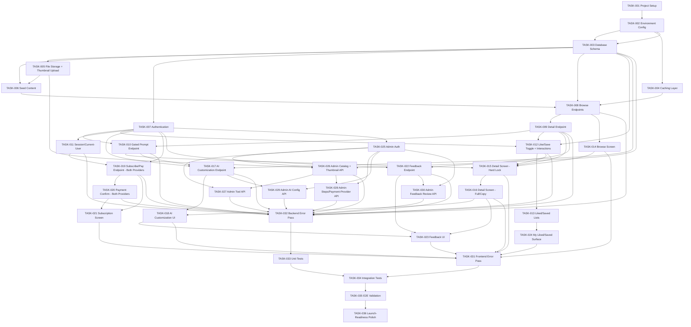

# AWA — 12-IMPLEMENTATION-PLAN.md

**Status:** Implementation planning stage. This document sequences the already-confirmed decisions (`01`–`11`, as revised for the Next.js/Supabase stack and the now-required AI customization, active R2 upload, dual-provider payments, and Likes/Saves capabilities) into buildable tasks — it introduces no new requirement, feature, architectural component, or screen beyond what `09-AI-DESIGN.md`, `10-TECH-STACK.md`, and `11-UI-UX.md` already confirm.

**Sources of truth:** `01-PROBLEM.md` through `11-UI-UX.md`, with `09-AI-DESIGN.md` (AI: REQUIRED, single-step prompt customization), `10-TECH-STACK.md` (Next.js full-stack + Supabase + Redis/Upstash + Cloudflare R2 **[ACTIVE]** + Razorpay **and** Stripe **[BOTH ACTIVE]**), and `11-UI-UX.md` (Hard Lock prompt treatment; Likes/Saves **[ACTIVE]**; the AI customization section on the Template Detail Screen) taken as the current, superseding versions.

**Audience:** A coding AI or developer implementing one task at a time.

**Rule applied throughout:** every task traces to a requirement, feature, entity, endpoint, or screen already confirmed in a prior document. Where a prior document left something explicitly unresolved, this plan marks it as an **Implementation Dependency** rather than inventing an answer.

```text
Architecture → Database → API → AI Decision → Tech Stack → UI/UX → Implementation Plan (this document)
```

### Revision note

This is a rewrite of the prior `12-IMPLEMENTATION-PLAN.md`, brought up to the same detail level as the working draft that had circulated alongside it, and corrected against three scope decisions that draft had not yet caught up to:

1. **Cloudflare R2** is an **active upload feature**, not infrastructure-only. TASK-005 now wires a real presigned-upload flow, and the Browse/Template Detail Screens render the resulting thumbnails.
2. **Likes/Saves** are in scope. New entities, endpoints, and UI tasks (TASK-012, TASK-013, TASK-024) implement the full vertical slice confirmed in `11-UI-UX.md` §16.
3. **Stripe** is built now as a **fully live second payment adapter**, not a reserved/empty configuration slot. TASK-019, TASK-020, and TASK-028 build and wire both providers.

---

## 1. Implementation Scope

### Required Components

| Component | Status | Source |
|---|---|---|
| Full-stack application (Next.js, single codebase for UI + API routes) | REQUIRED | `06-ARCHITECTURE-DECISION.md`; `10-TECH-STACK.md` §2.1 |
| Database (Supabase/PostgreSQL, via Prisma) | REQUIRED | `07-DATABASE.md`; `10-TECH-STACK.md` §4–5 |
| Authentication (Supabase Auth, four access levels, RLS + middleware) | REQUIRED | `10-TECH-STACK.md` §3 |
| Caching (Redis via Upstash) | REQUIRED | `10-TECH-STACK.md` §8 |
| File Storage (Cloudflare R2) | **REQUIRED — active upload feature**, backing template thumbnails via a signed-upload workflow | `10-TECH-STACK.md` §9 |
| AI Capability (single-step prompt customization, backend-mediated) | **REQUIRED** | `09-AI-DESIGN.md`; `10-TECH-STACK.md` §12–14 |
| Likes / Saves | **REQUIRED** — public aggregate counts, private per-user relationships, personal lists | `11-UI-UX.md` §16 |
| Payment Providers — Razorpay (launch/default) **and** Stripe (fully built, live second adapter) | **REQUIRED, both** | `10-TECH-STACK.md` §10 |
| Hosting/Deployment (Vercel + Supabase Cloud + Upstash + Cloudflare) | REQUIRED | `10-TECH-STACK.md` |
| Agents | NOT REQUIRED | `09-AI-DESIGN.md` — no autonomous agents, multi-agent systems, or planning |
| Background Processing | NOT REQUIRED | out of scope |
| Search / Vector Database | NOT REQUIRED | `09-AI-DESIGN.md` explicitly excludes RAG/vector storage |

This plan builds real AI integration, a real file-upload feature, a real second payment provider, and a real Likes/Saves feature — all previously deferred or conditional in earlier drafts. It still builds no agent, no multi-step AI reasoning pipeline, no model training, and no vector/RAG infrastructure — `09-AI-DESIGN.md`'s complexity ceiling (single-step transformation) remains a hard limit on the AI tasks specifically.

### Screens in Scope (from `11-UI-UX.md`)

Browse Screen, Template Detail Screen, Subscription Screen, plus a lightweight personal "My Liked / My Saved Templates" surface (`11-UI-UX.md` §28) reachable from the authenticated user's navigation. The Template Detail Screen includes the AI customization section, the Hard Lock non-subscriber state, and the thumbnail/like/save affordances as part of its confirmed component set — none of these add a fully separate screen requiring its own task beyond what's listed. The Administrator Interface remains out of this plan's UI-build scope (`11-UI-UX.md` §12): admin content, including AI provider/usage configuration, thumbnail assignment, and payment-provider configuration, is treated as API-driven (via authenticated tooling or direct calls), not a built admin frontend. Admin CRUD and configuration *endpoints* are real, confirmed requirements and are implemented as API tasks (Section 4); no admin frontend is built.

### Entities in Scope (from `07-DATABASE.md`, plus confirmed additions)

The original 8 entities — Category, Template, AITool, TemplateToolRecommendation, UsageStep, User, Administrator, Feedback — unchanged in their core shape.

**Confirmed additions:**

- **Usage-tracking structure** (`customization_usage`, or counters on `User`) — required by `09-AI-DESIGN.md`'s AI Cost and Usage section. Exact long-term shape (per-period counters vs. a full request ledger) remains flagged as an Implementation Dependency; this plan scaffolds the minimal structure that satisfies the requirement.
- **`Like`** — join entity: `id`, `userId` (FK → User), `templateId` (FK → Template), `createdAt`. Unique constraint on `(userId, templateId)`.
- **`Save`** — join entity: same shape as `Like`, tracking a separate relationship. Unique constraint on `(userId, templateId)`.
- **`Template.thumbnail_object_key`** and **`Template.thumbnail_url`** — new fields on the existing Template entity, populated via the R2 upload flow (TASK-005), nullable (a template with no thumbnail falls back to a UI placeholder, not an error).
- **Payment-provider fields** — `Subscription`/`User` payment-tracking fields (or a lightweight `PaymentTransaction` record, per the API doc's existing shape) must record **which provider** (`razorpay` or `stripe`) handled a given transaction, since both are live.

### Endpoints in Scope (from `08-API.md`, plus confirmed additions)

The original 29 endpoints, API-001 through API-029, unchanged in behavior except where the stack swap changes *how* they're implemented (Next.js Route Handlers instead of Express routes; Supabase Auth instead of a generic hosted identity service) — never *what* they do.

**Confirmed additions:**

- **API-030 — Submit Prompt Customization** (Subscriber-gated) — `09-AI-DESIGN.md` AI Workflow Steps 3–6.
- **API-031 — Get Customization Usage** (Authenticated User) — remaining-usage indicator.
- **API-032 — Configure AI Customization Settings** (Administrator) — usage/rate limits, AI provider config.
- **API-033 — Toggle Like** (Authenticated User) — `POST /api/templates/{templateId}/like`.
- **API-034 — Toggle Save** (Authenticated User) — `POST /api/templates/{templateId}/save`.
- **API-035 — Get My Interaction State** (Authenticated User) — `GET /api/templates/{templateId}/interactions` → `{ isLiked, isSaved }`, kept separate from the cached public detail response.
- **API-036 — Get My Liked Templates** (Authenticated User) — `GET /api/users/me/liked-templates`.
- **API-037 — Get My Saved Templates** (Authenticated User) — `GET /api/users/me/saved-templates`.
- **API-038 — Request Thumbnail Upload URL** (Administrator) — `POST /api/admin/templates/{templateId}/thumbnail/upload-url`, returns a short-lived signed R2 upload URL.
- **API-039 — Confirm Thumbnail Upload** (Administrator) — `POST /api/admin/templates/{templateId}/thumbnail/confirm`, records the object key and public read URL on the Template.

No other candidate from `08-API.md` §11's original "not implemented" list (device management, language management, usage video, etc.) is added.

---

## 2. Implementation Order

```text
1. Project Setup
2. Base Application Structure (Next.js full-stack)
3. Database (Supabase / Prisma) — incl. Like, Save, thumbnail, usage-tracking additions
4. Caching Layer (Redis / Upstash)
5. File Storage + Thumbnail Upload Flow (Cloudflare R2) — real feature, not infra-only
6. Content Seeding — incl. real thumbnails
7. Authentication / Authorization (Supabase Auth)
8. Backend / API (Public + Authenticated User endpoints, incl. Likes/Saves)
9. Core UI (Browse Screen — incl. thumbnails, like/save affordances)
10. Core UI (Template Detail Screen — base prompt, Hard Lock, thumbnails, like/save)
11. AI Customization (backend integration + UI section)
12. Payment Integration (Razorpay + Stripe, both live) + Subscription Screen
13. Feedback
14. Personal "My Liked / Saved" surface
15. Backend / API (Administrator endpoints, incl. AI, payment-provider, and thumbnail config)
16. Error Handling Pass
17. Testing Pass
18. End-to-End MVP Validation
19. Launch Preparation / Polish
```

Stages still skipped entirely: **Agent Integration**, **Background Processing**, **Search/Vector Infrastructure**. No task number is reserved for them.

---

## 3. Task List (Overview)

| Task | Name |
|---|---|
| TASK-001 | Initialize Next.js full-stack project structure |
| TASK-002 | Configure application environment |
| TASK-003 | Create database schema (8 core entities + usage-tracking + Like + Save + thumbnail fields) |
| TASK-004 | Configure caching layer (Upstash Redis) |
| TASK-005 | Configure file storage + thumbnail upload flow (Cloudflare R2) |
| TASK-006 | Seed MVP content (incl. real thumbnails) |
| TASK-007 | Integrate Supabase Auth (subscriber + admin identity) |
| TASK-008 | Implement categories/templates browse endpoints (cached, incl. thumbnails + like/save counts) |
| TASK-009 | Implement template detail (free content) endpoint (cached, incl. thumbnail + counts) |
| TASK-010 | Implement gated base-prompt retrieval endpoint (Hard Lock) |
| TASK-011 | Implement user session and current-user endpoints |
| TASK-012 | Implement Like/Save toggle + personal interaction-state endpoints |
| TASK-013 | Implement liked/saved templates list endpoints |
| TASK-014 | Build Browse Screen (incl. thumbnails, like/save affordances) |
| TASK-015 | Build Template Detail Screen — free content, Hard Lock state, thumbnail, like/save |
| TASK-016 | Build Template Detail Screen — full base-prompt state and copy action |
| TASK-017 | Implement AI customization endpoint (API-030/API-031) |
| TASK-018 | Build AI customization UI section |
| TASK-019 | Implement subscription initiation and payment endpoint (Razorpay + Stripe, both live) |
| TASK-020 | Implement payment confirmation endpoint (both providers) |
| TASK-021 | Build Subscription Screen (provider selection) |
| TASK-022 | Implement submit-feedback endpoint |
| TASK-023 | Build feedback UI section |
| TASK-024 | Build "My Liked / Saved Templates" personal surface |
| TASK-025 | Implement Administrator authentication |
| TASK-026 | Implement admin catalog endpoints (incl. thumbnail upload endpoints) |
| TASK-027 | Implement admin tool/recommendation endpoints |
| TASK-028 | Implement admin usage-step and payment-provider config endpoints (Razorpay + Stripe) |
| TASK-029 | Implement admin AI customization config endpoint (API-032) |
| TASK-030 | Implement admin feedback review endpoint |
| TASK-031 | Error-handling pass — frontend |
| TASK-032 | Error-handling pass — backend |
| TASK-033 | Unit test pass |
| TASK-034 | Integration test pass |
| TASK-035 | End-to-end MVP validation |
| TASK-036 | Launch-readiness polish pass |

**36 tasks total.**

---

## 4. Detailed Task Definitions

### TASK-001 — Initialize Next.js Full-Stack Project Structure

**Objective**
Create a single Next.js (App Router, TypeScript) project serving the end-user UI, the admin route group, and all backend logic as Route Handlers.

**Source Traceability**: `06-ARCHITECTURE-DECISION.md`; `10-TECH-STACK.md` §2.1.

**Dependencies**: None

**Implementation Instructions**
- Scaffold Next.js App Router + TypeScript + Tailwind CSS + shadcn/ui, per `10-TECH-STACK.md` §2.1.
- Create route-group structure: public/subscriber routes at root, a role-protected `admin/` group reserved (protection added in TASK-025).
- Add a minimal `GET /api/health` Route Handler.
- No database, auth, caching, storage, payment, or AI dependency yet — structure only.

**Acceptance Criteria**
- Dev server starts and renders a placeholder page.
- `/api/health` responds from the same running process.

**What to Test**: Dev server startup; `/api/health` happy path.

---

### TASK-002 — Configure Application Environment

**Objective**
Establish environment-variable-based configuration for every external service this plan actually uses live: Supabase, Upstash, Cloudflare R2, Razorpay, **Stripe (live, not reserved)**, and the AI provider.

**Source Traceability**: `10-TECH-STACK.md` §15–16.

**Dependencies**: TASK-001

**Implementation Instructions**
- Define placeholder env vars for: Supabase URL/keys, Upstash REST URL/token, R2 bucket/access keys, Razorpay public/secret keys, **Stripe public/secret keys and webhook signing secret (configured as a fully active credential set, not a reserved/unused placeholder)**, and the AI provider API key/base URL.
- Fail fast with a clear startup error if any required variable is missing.
- No real secret is ever committed; `.env.example` lists every variable with placeholder values only.

**Acceptance Criteria**
- Missing required variable → clear startup failure.
- All variables present → successful startup, including Stripe credentials being validated as present (not silently optional).

**What to Test**: Missing-variable failure (for each provider, including Stripe); full-variable success.

---

### TASK-003 — Create Database Schema (Core Entities + Usage-Tracking + Like + Save + Thumbnail Fields)

**Objective**
Create the Supabase/PostgreSQL schema, via Prisma, for the 8 confirmed entities plus four confirmed additions: usage-tracking, `Like`, `Save`, and thumbnail fields on `Template`.

**Source Traceability**: `07-DATABASE.md` §3–§6; `09-AI-DESIGN.md` (usage-tracking); `11-UI-UX.md` §16 (Likes/Saves); `10-TECH-STACK.md` §9 (thumbnail fields).

**Dependencies**: TASK-002

**Implementation Instructions**
- Define one Prisma model per original entity exactly as `07-DATABASE.md` §4 specifies. Do not add fields not listed there, except the confirmed additions below.
- Implement relationships exactly as `07-DATABASE.md` §6 specifies.
- **Usage-tracking addition:** a `customization_usage` table (or counters on `User`) recording, at minimum, a per-subscriber count of AI customization requests within the current period. Keep to the minimal structure satisfying `09-AI-DESIGN.md`'s requirement.
- **`Like` model:** `id`, `userId` (FK → User, cascade delete), `templateId` (FK → Template, cascade delete), `createdAt`. Unique composite index on `(userId, templateId)` — a user can like a template at most once; toggling is delete-if-exists / create-if-absent, not a boolean flag on a growing table.
- **`Save` model:** identical shape to `Like`, separate table, separate unique composite index.
- **`Template` additions:** `thumbnail_object_key` (nullable string), `thumbnail_url` (nullable string). Both null by default — a template with no thumbnail is a valid, non-error state.
- Add a lightweight `provider` field (`razorpay` | `stripe`) to whatever payment-transaction record `07-DATABASE.md`/`08-API.md` already define, so a subscription's originating provider is always recoverable.
- Enforce prior defaults unchanged: `Template.is_published` defaults `false`; `AITool.is_active` defaults `true`; `User.subscription_status` defaults `inactive`.

**Acceptance Criteria**
- All 8 core tables plus `customization_usage`, `Like`, `Save`, and the `Template` thumbnail fields exist with correct types/defaults.
- Foreign keys match `07-DATABASE.md` §6, plus cascade-delete behavior on `Like`/`Save` when a User or Template is deleted.
- Attempting to insert a duplicate `(userId, templateId)` `Like` or `Save` row fails at the database level (relied upon by TASK-012's toggle logic).
- A payment-transaction record can store `provider = 'razorpay'` or `provider = 'stripe'`.

**What to Test**
- Migrations run cleanly against an empty database.
- FK violations rejected for every relationship, including `Like`/`Save`.
- Duplicate `(userId, templateId)` Like/Save insert is rejected by a unique constraint.
- A Template can be created with null thumbnail fields and later updated with real values.

---

### TASK-004 — Configure Caching Layer (Upstash Redis)

**Objective**
Set up the Redis (Upstash) cache utility, with an invalidation-hook pattern ready for admin writes and for Like/Save count changes.

**Source Traceability**: `10-TECH-STACK.md` §8.

**Dependencies**: TASK-002

**Implementation Instructions**
- Implement `getCached(key)`, `setCached(key, value, ttl)`, `invalidate(key or prefix)` on Upstash's REST-compatible client.
- Establish a key-naming convention covering categories, templates, and **like/save aggregate counts** (e.g., `template:<id>:counts`) with a short TTL, since counts change more often than catalog metadata and don't need strict real-time accuracy for the public aggregate display.
- Not wired into any endpoint yet — TASK-008/009/012 are the first consumers.

**Acceptance Criteria**
- Set → get → invalidate round trip works against a real Upstash instance.
- A cache miss is distinguishable from a cached empty result.

**What to Test**: Set/get/invalidate round trip; TTL expiry behavior.

---

### TASK-005 — Configure File Storage and Thumbnail Upload Flow (Cloudflare R2)

**Objective**
Provision the Cloudflare R2 bucket and implement the **full, live** presigned-upload workflow for template thumbnails — this is a real MVP feature, not infrastructure held in reserve.

**Source Traceability**: `10-TECH-STACK.md` §9 (Active upload architecture: file-type validation, size limits, content inspection, restricted permissions, short-lived signed URLs, safe media serving).

**Dependencies**: TASK-002, TASK-003

**Implementation Instructions**
- Create the R2 bucket; configure credentials via TASK-002's environment variables.
- Implement a storage-access module: `createSignedUploadUrl(objectKey, contentType)` and `getPublicReadUrl(objectKey)`, wrapping R2's S3-compatible API.
- Implement **API-038 — Request Thumbnail Upload URL** (Administrator-only): validates the requested content-type against an allowlist (e.g., `image/jpeg`, `image/png`, `image/webp`) and a maximum declared size, generates a short-lived (minutes, not hours) signed upload URL scoped to a single object key derived from the template ID, and returns it.
- Implement **API-039 — Confirm Thumbnail Upload** (Administrator-only): after the admin's client uploads directly to R2 using the signed URL, this endpoint re-validates the uploaded object (content-type as reported by R2, actual size) before writing `thumbnail_object_key`/`thumbnail_url` onto the `Template` row, and invalidates the relevant template cache entries (TASK-004, TASK-009).
- Served thumbnail URLs must not be treated as executable content; set response/object headers so a browser never interprets a stored image as a script.
- R2 secret credentials never reach the browser — only the short-lived signed URL does.

**Acceptance Criteria**
- An Administrator can request a signed upload URL, upload a real image directly to R2 using it, and confirm the upload — after which the template's public detail response (TASK-009) includes a working `thumbnail_url`.
- A non-Administrator caller is rejected by both API-038 and API-039.
- An oversized or wrong-content-type upload attempt is rejected before or at confirmation.
- A signed upload URL expires and can no longer be used after its short lifetime.
- Confirming a thumbnail invalidates the correct cache entry, so the new thumbnail appears on the very next public request.

**What to Test**
- Full upload-then-confirm round trip against a real R2 bucket.
- Authorization rejection for non-Administrators on both endpoints.
- File-type and size-limit rejection.
- Signed-URL expiry.
- Cache invalidation after confirmation.

---

### TASK-006 — Seed MVP Content

**Objective**
Populate the database with real content across all five launch categories, including **real uploaded thumbnails** via TASK-005's flow, not placeholder image paths.

**Source Traceability**: `05-MVP.md` §7, §9, §17; TASK-005's confirmed upload flow.

**Dependencies**: TASK-003, TASK-005

**Implementation Instructions**
- Seed five categories, each with at least one subcategory.
- Seed a curated set of finished-text templates per category, each with a real, complete `prompt_text`.
- For each seeded template, run it through the **real** TASK-005 upload flow (request URL → upload a real image → confirm) rather than writing a placeholder URL directly into the database — this exercises the actual feature the seed step is supposed to validate.
- Seed at least one AITool, at least one `TemplateToolRecommendation` per template with a real reason, and at least one `UsageStep` sequence per template.
- Mark all seeded templates `is_published = true`.
- Initialize each seeded/test User's usage-tracking record to a reasonable default customization allowance.
- Leave `Like`/`Save` tables empty at seed time (zero counts is a valid starting state) unless a small number of seed likes/saves are useful for demoing the aggregate-count UI — optional, not required.

**Acceptance Criteria**
- All five categories exist with at least one subcategory each.
- Every seeded template has a non-empty `prompt_text`, a working `thumbnail_url` produced via the real upload flow, at least one tool recommendation with a reason, and at least one usage step.
- Seeded/test Users have a non-zero initial customization usage allowance.

**What to Test**
- Category/template queries return complete, non-placeholder seeded data.
- Each seeded template's `thumbnail_url` resolves to a real, fetchable image.
- A seeded test User's usage-tracking record is queryable.

---

### TASK-007 — Integrate Supabase Auth (Subscriber + Admin Identity)

**Objective**
Integrate Supabase Auth scoped to two identity types — User and Administrator — with role enforcement via RLS plus Next.js middleware.

**Source Traceability**: `10-TECH-STACK.md` §3.

**Dependencies**: TASK-003

**Implementation Instructions**
- Implement the four access levels: Public, Authenticated User, Subscriber (User with `subscription_status = active`), Administrator.
- A valid Supabase session alone never implies subscriber or admin access — AWA's own tables remain the authorization source.
- Enforce at both the RLS and Route Handler/middleware layers.
- Create a `User` record on first successful sign-in if one doesn't exist (`subscription_status = inactive`).
- Provision at least one Administrator record via a one-time seed step (TASK-006), not self-service registration.

**Acceptance Criteria**
- Each of the four access levels behaves correctly for no-credential, non-subscriber, subscriber, and administrator callers.
- A tampered/invalid session token is rejected.
- An RLS policy is exercised directly, confirming database-layer enforcement independent of middleware.

**What to Test**: All four access levels; invalid-token rejection; direct RLS exercise.

---

### TASK-008 — Implement Categories/Templates Browse Endpoints (Cached, Incl. Thumbnails + Counts)

**Objective**
Implement the public browsing endpoints, now returning each template's thumbnail and public like/save counts, read through the cache.

**Source Traceability**: API-001, API-002; `10-TECH-STACK.md` §8; `11-UI-UX.md` §16 (public aggregate counts).

**Dependencies**: TASK-003, TASK-004, TASK-006

**Implementation Instructions**
- `GET /api/categories`: unchanged behavior from the prior plan — top-level or child categories by `parentCategoryId`.
- `GET /api/templates`: accepts category context and optional tag/search filter; returns only `is_published = true` templates. Each returned template now includes `thumbnailUrl` (nullable — the frontend must handle a null thumbnail with a placeholder, not an error) and `likeCount`/`saveCount` (both public aggregates, always present, defaulting to 0).
- Read through the cache first; populate on a miss with a TTL appropriate to counts changing more often than catalog content (per TASK-004).
- Both endpoints remain Public — no authentication required for browsing, liking, or saving state included here (that's TASK-012's separate, non-cached, per-user endpoint).

**Acceptance Criteria**
- `GET /api/categories` returns the five seeded categories; invalid `parentCategoryId` → Not Found.
- `GET /api/templates` returns only published templates, each with a thumbnail (or null) and accurate like/save counts.
- A non-matching filter returns an empty list, not an error.
- A repeated identical request is served from cache.

**What to Test**: Happy paths; Not Found; empty-filter case; unpublished-template exclusion; cache hit verification; thumbnail/count presence.

---

### TASK-009 — Implement Template Detail (Free Content) Endpoint (Cached, Incl. Thumbnail + Counts)

**Objective**
Implement the public template-detail endpoint, extended with thumbnail and like/save counts, explicitly excluding `prompt_text` and any per-user interaction flag.

**Source Traceability**: API-003; `11-UI-UX.md` §3, §16.

**Dependencies**: TASK-008

**Implementation Instructions**
- Return `templateId`, `name`, `description`, `tags`, `thumbnailUrl`, `likeCount`, `saveCount`, `recommendations`, ordered `usageSteps`.
- Never include `prompt_text`, and never include whether the *current caller* has liked/saved it — that per-user state is TASK-012's separate `GET /api/templates/{templateId}/interactions`, kept out of this cached, caller-agnostic response on purpose.
- Not Found for a non-existent or unpublished `templateId`.
- Read through cache; invalidate on admin edits (TASK-026) and on thumbnail confirmation (TASK-005).

**Acceptance Criteria**
- Response includes thumbnail (or null) and accurate like/save counts alongside the existing fields.
- Response never includes prompt text or a per-user like/save flag.
- Not Found for invalid template ID.

**What to Test**: Happy path incl. counts/thumbnail; absence of prompt text and per-user flags; Not Found; cache invalidation after an admin edit or thumbnail confirmation.

---

### TASK-010 — Implement Gated Base-Prompt Retrieval Endpoint (Hard Lock)

**Objective**
Implement the MVP's core value-delivery endpoint using the confirmed **Hard Lock** treatment: no prompt text of any length for a non-subscriber, the full base prompt for an active subscriber.

**Source Traceability**: API-004; `11-UI-UX.md` §4–5 (Hard Lock, confirmed — the "Safe Preview" alternative was considered and rejected).

**Dependencies**: TASK-007, TASK-009

**Implementation Instructions**
- Unauthenticated or non-subscribed caller receives `{ templateId, locked: true }` with **no `promptPreview` or any partial text field at all** — the Hard Lock decision means this response shape has no excerpt field to omit-or-fill; it simply isn't present in the schema.
- Active subscriber receives `{ templateId, locked: false, promptText: "<full text>" }`.
- Unauthenticated caller must not receive an error — treated as a non-subscriber.
- No AI involvement at this endpoint — return `Template.prompt_text` exactly as authored.
- Not cached (depends on per-caller subscription state).

**Acceptance Criteria**
- Anonymous and non-subscribed requests both return `locked: true` with zero prompt text present anywhere in the payload.
- Active subscriber receives `locked: false` and the exact stored base prompt, character-for-character.
- Not Found for invalid template ID.

**What to Test**: All three caller states; confirm zero-byte prompt exposure for non-subscribers (not just a truncated one); Not Found.

---

### TASK-011 — Implement User Session and Current-User Endpoints

**Objective**
Implement the endpoints establishing and retrieving a User's identity and subscription state via Supabase Auth.

**Source Traceability**: API-005, API-006.

**Dependencies**: TASK-007

**Implementation Instructions**
- Confirm/complete the mapping to AWA's `User` table on session establishment (creating one on first sign-in, per TASK-007).
- `GET /api/users/me`: returns `subscription_plan` and `subscription_status`.

**Acceptance Criteria**
- First-time sign-in creates a `User` record with `subscription_status = inactive`.
- Returning subscribed identifier is recognized correctly.
- Unauthenticated `GET /api/users/me` fails cleanly.

**What to Test**: First-time and returning sign-in; unauthenticated rejection (never defaults to "subscribed").

---

### TASK-012 — Implement Like/Save Toggle + Personal Interaction-State Endpoints

**Objective**
Implement the private, per-user Like and Save actions (API-033, API-034) and the personal interaction-state lookup (API-035) — kept separate from the cached public counts in TASK-008/009.

**Source Traceability**: API-033, API-034, API-035; `11-UI-UX.md` §16.

**Dependencies**: TASK-003, TASK-007, TASK-009

**Implementation Instructions**
- `POST /api/templates/{templateId}/like` — Authenticated User only. Toggle semantics: if a `Like` row for `(userId, templateId)` exists, delete it (un-like); otherwise create it. Relies on TASK-003's unique constraint to prevent a race from double-inserting.
- `POST /api/templates/{templateId}/save` — identical toggle semantics against the `Save` table.
- Both actions invalidate the relevant cached count key (TASK-004/008/009) so the public aggregate reflects the change promptly, without requiring the count response itself to be real-time-exact.
- `GET /api/templates/{templateId}/interactions` — Authenticated User only, **not cached** (it's per-caller): returns `{ isLiked: boolean, isSaved: boolean }` for the current user against the given template. An anonymous caller is rejected here (the frontend should not call this endpoint for anonymous users — liking/saving itself requires authentication per `11-UI-UX.md` §16).
- Reject an unauthenticated toggle attempt cleanly rather than silently no-opping, so the frontend can distinguish "not logged in" from "action failed."

**Acceptance Criteria**
- A first toggle call creates the Like/Save row and increments the public count on the next detail fetch; a second toggle call removes it and decrements the count.
- Two rapid, concurrent toggle calls from the same user do not leave the count off by more than the number of net toggles actually intended (no silent double-count from a race).
- `GET .../interactions` correctly reflects current state for the calling user only, never another user's.
- Unauthenticated calls to all three endpoints are rejected, not silently ignored.

**What to Test**: Toggle-on/toggle-off round trip for both Like and Save; count invalidation reflected on next detail fetch; concurrent-toggle race behavior; interactions endpoint correctness; unauthenticated rejection on all three.

---

### TASK-013 — Implement Liked/Saved Templates List Endpoints

**Objective**
Implement the endpoints backing a user's personal "My Liked Templates" / "My Saved Templates" lists (API-036, API-037).

**Source Traceability**: API-036, API-037; `11-UI-UX.md` §15, §16, §28.

**Dependencies**: TASK-012

**Implementation Instructions**
- `GET /api/users/me/liked-templates` — Authenticated User only: returns the caller's liked templates (joining `Like` → `Template`), each with the same public-safe fields as the browse-list response (title, thumbnail, tags — no prompt text), ordered most-recently-liked first.
- `GET /api/users/me/saved-templates` — identical shape against `Save`.
- Both are inherently per-user and must never leak another user's liked/saved list, even with a manipulated ID — there is no `userId` parameter to manipulate; the caller is always resolved from the session.
- An empty list is a valid, non-error response.

**Acceptance Criteria**
- Each endpoint returns exactly the calling user's own liked/saved templates, most-recent first, with public-safe fields only.
- A user with no likes/saves receives an empty array, not an error.
- Unauthenticated calls are rejected.

**What to Test**: Happy path against seeded/toggled data; empty-list case; confirm no cross-user leakage (attempt with two different authenticated sessions); unauthenticated rejection.

---

### TASK-014 — Build Browse Screen (Incl. Thumbnails, Like/Save Affordances)

**Objective**
Implement the Browse Screen per `11-UI-UX.md` §2, now rendering template thumbnails and like/save counts on each card.

**Source Traceability**: `11-UI-UX.md` §2; API-001, API-002.

**Dependencies**: TASK-008

**Implementation Instructions**
- Implement header, breadcrumb, category/subcategory list, template list, tag search/filter, empty-state message — as before.
- Each template card now renders its `thumbnailUrl` (with a defined placeholder graphic when null) and its `likeCount`/`saveCount` as public, read-only figures on this screen — the like/save *action* itself lives on the Template Detail Screen (TASK-015), not the card, per `11-UI-UX.md` §16's distinction between public discovery signal and the private action.
- Loading, Error, and Empty States as previously specified.
- Selecting a template navigates to the Template Detail Screen, passing `templateId`.

**Acceptance Criteria**
- All five categories visible with no sign-in required.
- Each template card shows its thumbnail (or placeholder) and like/save counts.
- Category drill-down, tag filtering, empty states behave as previously specified.

**What to Test**: Happy path incl. thumbnail/count rendering; placeholder-thumbnail case; existing filter/empty/error state coverage.

---

### TASK-015 — Build Template Detail Screen (Free Content, Hard Lock State, Thumbnail, Like/Save)

**Objective**
Implement the Template Detail Screen's always-visible free content, the Hard Lock non-subscriber state, the thumbnail, and the Like/Save action buttons — the AI customization section and full-prompt state remain out of scope here.

**Source Traceability**: `11-UI-UX.md` §3–5, §16, §27; API-003, API-004, API-033–035.

**Dependencies**: TASK-009, TASK-010, TASK-012, TASK-014

**Implementation Instructions**
- Fetch free content via `GET /api/templates/{templateId}` (TASK-009): render thumbnail, title, description, tags, recommendation card(s), usage steps, and public like/save counts.
- Fetch the base prompt via `GET /api/templates/{templateId}/prompt` (TASK-010). For a non-subscriber, render the **Hard Lock** panel exactly as `11-UI-UX.md` §4 specifies: a lock icon, a plain-text explanation, and a "Subscribe to Unlock" CTA — **no prompt text, partial or otherwise, anywhere in the DOM.**
- If authenticated (regardless of subscription status), fetch `GET /api/templates/{templateId}/interactions` (TASK-012) and render Like/Save buttons reflecting the caller's current state; clicking either calls the corresponding toggle endpoint and updates the button state and visible count optimistically, reconciling with the server response.
- If not authenticated, Like/Save buttons are visible but clicking either routes to login rather than silently failing or hiding the buttons — consistent with `11-UI-UX.md` §16's requirement that Like/Save actions require authentication while viewing counts stays public.
- "No tool/model configured" fallback unchanged from prior behavior.
- The "Subscribe to Unlock" CTA navigates to the Subscription Screen (TASK-021).
- Full base-prompt state, copy action, AI customization section, and feedback section remain out of scope for this task.

**Acceptance Criteria**
- Description, tags, thumbnail, recommendations, usage steps, and like/save counts are all visible without a subscription.
- A non-subscriber sees the Hard Lock state with zero prompt text present, and a working subscribe CTA.
- An authenticated (non-subscriber) user can like/save the template; the button and count update correctly.
- An unauthenticated visitor attempting to like/save is routed to login, not silently ignored.

**What to Test**: Happy path for non-subscriber state incl. thumbnail/counts; Hard Lock zero-prompt-exposure check; like/save toggle for an authenticated non-subscriber; unauthenticated like/save attempt; no-recommendation fallback; navigation replacement between templates.

---

### TASK-016 — Build Template Detail Screen (Full Base-Prompt State and Copy Action)

**Objective**
Implement the subscriber-facing full base-prompt state and the copy action.

**Source Traceability**: `11-UI-UX.md` §6–7; API-004.

**Dependencies**: TASK-015

**Implementation Instructions**
- When `locked: false`, render the complete `promptText`, fully readable/scrollable, never truncated.
- Implement the copy action: places the exact text on the clipboard, shows an inline confirmation labeled as the **base** prompt, and reveals the feedback section (TASK-023).
- Implement the copy-failure fallback: inline message, text remains visible/selectable.
- Render the customization section's collapsed entry point (component only; behavior in TASK-018).

**Acceptance Criteria**
- Subscriber sees the complete, unblurred base prompt.
- Copy action places exact text on clipboard with a correctly labeled confirmation.
- Long prompt scrolls without truncation.
- Copy-failure fallback preserves visible text.

**What to Test**: Happy path copy; long-prompt rendering; copy-failure simulation; Hard Lock state (TASK-015) unaffected by regression.

---

### TASK-017 — Implement AI Customization Endpoint (API-030/API-031)

**Objective**
Implement the backend-mediated AI prompt-customization endpoint and its usage-lookup companion.

**Source Traceability**: `09-AI-DESIGN.md`; API-030, API-031.

**Dependencies**: TASK-003, TASK-007, TASK-010

**Implementation Instructions**
- `POST /api/templates/{templateId}/customize` — Subscriber-gated only.
- Order of operations: (1) confirm Subscriber, (2) validate request (non-empty, length-limited), (3) check usage/credit limit — reject with no provider call if exceeded, (4) call the AI provider through a server-side abstraction with the base prompt + customization request, keeping system instructions separate from user input, (5) validate the response (non-empty, size-limited, treated as plain text) before returning it, (6) increment usage only on a successful, validated response, (7) return the customized prompt.
- AI provider credentials never reach the client.
- Provider failures return a distinct, clearly-typed error, never a generic one.
- `GET /api/users/me/customization-usage` returns current usage/limit for the period.
- Single-step transformation only — no multi-turn state, no chaining.

**Acceptance Criteria**
- Non-subscriber rejected exactly as any other Subscriber-only endpoint.
- Valid request under limit succeeds, returns a customized prompt, increments usage by exactly one.
- Request at/over limit rejected with no provider call made.
- Simulated provider failure returns a distinct error, does not increment usage.
- Rapid duplicate submissions don't silently double-count usage beyond actual requests made.

**What to Test**: Happy path with usage increment; non-subscriber rejection; limit-reached rejection with no provider call; provider-failure/invalid-response handling; usage lookup correctness.

---

### TASK-018 — Build AI Customization UI Section

**Objective**
Implement the customization section on the Template Detail Screen.

**Source Traceability**: `11-UI-UX.md` §17–23; API-030, API-031.

**Dependencies**: TASK-016, TASK-017

**Implementation Instructions**
- Render only in the subscribed/full base-prompt state, collapsed by default, expanding on engagement.
- On submit, call TASK-017's endpoint; show a scoped loading state within the section only — base prompt and rest of screen remain visible/usable.
- On success, render the Customized Prompt panel, clearly labeled and visually distinct from the Base Prompt panel — both visible simultaneously.
- Implement refine (submit a further request against the current customized prompt) and discard (remove the panel, base prompt unaffected) actions.
- Implement the AI error state: scoped, plain-worded, retry action preserving the submitted text; base prompt remains usable throughout.
- Implement the usage-limit-reached state: disable input with a plain message.
- Extend the copy action to distinguish base vs. customized prompt copying, each clearly labeled.
- Keep visually/textually distinct from the (non-AI) tool/model recommendation card.

**Acceptance Criteria**
- Section visible only to subscribers, collapsed by default.
- Submit → scoped loading → Customized Prompt panel beside unchanged base prompt.
- Refine and discard both work correctly.
- Simulated failure shows scoped error with preserved text; base prompt stays usable.
- Usage-limit-reached disables input with a plain message.
- Copy action correctly labels which prompt was copied.

**What to Test**: Happy path; refine/discard; failure with text preservation; usage-limit simulation; copy-action labeling; recommendation-card regression.

---

### TASK-019 — Implement Subscription Initiation and Payment Endpoint (Razorpay + Stripe, Both Live)

**Objective**
Implement the endpoint that lets an authenticated User choose a plan and begin a payment transaction through **either** Razorpay or Stripe, both built as fully working adapters behind a shared interface — not Razorpay-now/Stripe-later.

**Source Traceability**: API-007, API-028; `10-TECH-STACK.md` §10.2 (Stripe confirmed as a real, scaffolded-now second provider).

**Dependencies**: TASK-007, TASK-011

**Implementation Instructions**
- `POST /api/subscriptions` accepts `planType` (`yearly` or `lifetime`) and, since both providers are live, an optional `provider` selector (`razorpay` | `stripe`); default to the application-configured default provider (TASK-028) when omitted. The caller's `provider` choice never determines credentials or endpoints — only which pre-configured adapter handles the request.
- Implement the payment-provider interface (`createTransaction`, `confirmTransaction`) with **two real implementations**: a Razorpay adapter and a **fully functional Stripe adapter** — both must be independently callable and independently testable, not a Stripe stub that returns "not yet available."
- Do not update `User.subscription_status` at this step — only on confirmed payment (TASK-020).
- Route the request through the selected adapter; return the client-facing checkout reference for whichever provider was used.
- A provider-unavailable condition (either Razorpay or Stripe) returns a clear Service Unavailable response, leaving any existing access state untouched; the other provider remaining available is not itself a fallback unless the user explicitly re-initiates with it.
- Keep the shared interface to the minimum shape both adapters need (create transaction, confirm transaction) — do not over-build beyond what both providers actually require.

**Acceptance Criteria**
- A valid `planType` with either `provider` value returns a checkout reference for that specific provider, without altering subscription status.
- Both the Razorpay and the Stripe adapter can independently complete a real (sandbox) transaction end-to-end.
- An invalid `planType` is rejected.
- A simulated unavailable condition for either provider returns a clear, distinct error and leaves state unchanged.

**What to Test**: Happy path for both plan types **through both providers independently**; invalid `planType`; simulated unavailability for each provider separately; confirm subscription status unchanged immediately after this call regardless of provider.

---

### TASK-020 — Implement Payment Confirmation Endpoint (Both Providers)

**Objective**
Implement the endpoint that receives payment outcome from **either** Razorpay or Stripe and updates the User's subscription state accordingly.

**Source Traceability**: API-029; `05-MVP.md` §16.

**Dependencies**: TASK-019

**Implementation Instructions**
- Handle confirmation from both providers, each with its own signature-verification logic (Razorpay's and Stripe's webhook/callback verification are not interchangeable — implement both correctly, not a shared shortcut that only really validates one).
- On confirmed successful payment (from either provider), set `User.subscription_status = active`, `subscription_plan`, `subscription_start_date`, and record which `provider` handled the transaction (TASK-003's addition).
- On confirmed failed payment, leave subscription status unchanged.
- This endpoint must be idempotent per provider: receiving the same confirmation twice (from either provider) must not double-apply the update.
- Confirm a newly active subscriber's usage-tracking record is initialized correctly regardless of which provider was used.
- **Implementation Dependency (unresolved upstream):** webhook vs. synchronous confirmation — implement whichever mechanism each provider's current documentation recommends, and document the choice made per provider (they may differ from each other).

**Acceptance Criteria**
- A successful confirmation from **either** provider activates the subscription correctly, with the correct `provider` recorded.
- A failed confirmation from either provider leaves status unchanged.
- Duplicate confirmations (same provider, same transaction) don't double-apply.
- Post-activation, TASK-010 and TASK-017 both work correctly for the newly subscribed user, regardless of which provider was used.

**What to Test**: Success/failure happy paths for **each provider independently**; duplicate-confirmation idempotency per provider; end-to-end unlock verification for both providers.

---

### TASK-021 — Build Subscription Screen (Provider Selection)

**Objective**
Implement the Subscription Screen, now offering a real choice between Razorpay and Stripe as both are live.

**Source Traceability**: `11-UI-UX.md` §9–10; API-007, API-028, API-029.

**Dependencies**: TASK-019, TASK-020

**Implementation Instructions**
- Implement plan selector, unlock-explanation text (covering both base-prompt access and AI customization in one sentence), contact-identifier field, and **a payment-provider choice** (Razorpay / Stripe) alongside the plan selector, since a caller can genuinely use either.
- On "Proceed to pay," call TASK-019 with the selected `planType` and `provider`, then hand off to the corresponding checkout flow (Razorpay checkout SDK or Stripe checkout/Elements, whichever was selected).
- Implement Loading, Error, and Success states exactly as `11-UI-UX.md` §10 specifies, per-provider where the flows visually differ (e.g., Stripe's redirect-based checkout vs. Razorpay's in-page modal) but with identical semantics: pay action disabled during processing, failed payment returns to the non-subscribed state, never a false "subscribed" state.
- On confirmed success, return to the Template Detail Screen, which re-fetches and now renders the full base prompt and available customization section.
- "Cancel" returns to the Template Detail Screen without altering subscription state, regardless of which provider was mid-flow.

**Acceptance Criteria**
- Both plans are selectable; both providers are selectable and independently completable.
- Pay action disables during processing for either provider.
- Successful payment through either provider returns the user to an unlocked Template Detail Screen.
- Failed payment through either provider shows the defined error state and leaves access unchanged.
- Cancel works correctly regardless of provider mid-flow.

**What to Test**: Happy path for both plans × both providers (four combinations); failure simulation per provider; cancel path per provider; duplicate-submission prevention.

---

### TASK-022 — Implement Submit-Feedback Endpoint

**Objective**
Implement the endpoint capturing a rating, optional comment, and optional tool-used, linked to a template.

**Source Traceability**: API-008.

**Dependencies**: TASK-007, TASK-009

**Implementation Instructions**
- Accept `rating` (required, `up`/`down`), `comment` (optional), `toolUsed` (optional, must reference an existing AITool).
- Reject missing/invalid `rating`, unauthenticated requests, non-existent `templateId`/`toolUsed`.
- Caller need only be an Authenticated User, not necessarily an active subscriber.
- Optionally accept an indicator of whether the customized version was used, consistent with `11-UI-UX.md` §3.2's optional field.

**Acceptance Criteria**
- Valid submissions succeed (rating-only; rating+comment; rating+comment+toolUsed).
- Missing/invalid rating rejected; unauthenticated rejected; invalid `toolUsed` rejected.

**What to Test**: Happy-path combinations; validation failures; unauthenticated rejection.

---

### TASK-023 — Build Feedback UI Section

**Objective**
Implement the feedback UI section, shown after a successful copy action of either the base or customized prompt.

**Source Traceability**: `11-UI-UX.md` §24; API-008.

**Dependencies**: TASK-016, TASK-018, TASK-022

**Implementation Instructions**
- Render only after a copy action from either TASK-016's base-prompt copy or TASK-018's customized-prompt copy.
- Thumbs up/down (optional), comment (optional), tool used (optional).
- Success/Error states as specified; failure preserves entered values.

**Acceptance Criteria**
- Hidden until a copy action occurs, from either prompt version.
- Rating-only and full-field submissions both succeed with confirmation.
- Simulated failure preserves entered values.

**What to Test**: Visibility trigger from both copy sources; happy-path field combinations; failure with value preservation.

---

### TASK-024 — Build "My Liked / Saved Templates" Personal Surface

**Objective**
Implement the lightweight authenticated-user screen/section listing the caller's liked and saved templates, per `11-UI-UX.md` §15, §16, §28.

**Source Traceability**: `11-UI-UX.md` §15, §16, §28; API-036, API-037.

**Dependencies**: TASK-013

**Implementation Instructions**
- Implement two lists (or a tabbed single view) — "My Liked Templates" and "My Saved Templates" — reachable from the authenticated navigation, each backed by TASK-013's endpoints.
- Each entry links to the corresponding Template Detail Screen.
- Empty state: a plain message when the user has liked/saved nothing yet, not an error.
- This surface is private to the signed-in user — never expose a route or parameter that could list another user's liked/saved templates.

**Acceptance Criteria**
- An authenticated user sees exactly their own liked and saved templates, most-recent first.
- Empty state renders correctly for a user with no likes/saves.
- Each entry navigates correctly to its Template Detail Screen.
- The surface is unreachable/rejected for an unauthenticated visitor.

**What to Test**: Happy path against toggled data; empty state; navigation from list entries; unauthenticated access rejection.

---

### TASK-025 — Implement Administrator Authentication

**Objective**
Implement Administrator-specific authentication via Supabase Auth, scoped to Administrator records only.

**Source Traceability**: API-009.

**Dependencies**: TASK-007

**Implementation Instructions**
- Verify an Administrator credential via Supabase Auth, scoped to Administrator records only.
- Protect the entire `admin/` route group at the Next.js middleware level, in addition to per-endpoint checks.

**Acceptance Criteria**
- Valid Administrator credential succeeds with an Administrator-scoped session.
- A valid, non-Administrator User is rejected at this endpoint and at the route-group level.

**What to Test**: Happy path for the seeded Administrator; rejection of a valid non-Administrator User.

---

### TASK-026 — Implement Admin Catalog Endpoints (Incl. Thumbnail Upload Endpoints)

**Objective**
Implement the Administrator endpoints for managing categories and templates, including the thumbnail upload endpoints from TASK-005.

**Source Traceability**: API-010–016, API-038, API-039.

**Dependencies**: TASK-025, TASK-003, TASK-005

**Implementation Instructions**
- Restrict every endpoint to Administrator access.
- Standard CRUD against Category and Template, including `is_published` toggle and admin listing of unpublished drafts.
- Include API-038/API-039 (thumbnail upload request/confirm) as part of this task's endpoint group, since they're template-scoped admin operations.
- Invalidate relevant cache keys on every write, including thumbnail confirmation.
- **Implementation Dependency (unresolved upstream):** cascading-delete behavior for a Category with children or a Template with existing Feedback/Likes/Saves is unspecified. Implement the simplest safe default (reject deletion when dependent records exist, including Like/Save rows) and flag as an open question.

**Acceptance Criteria**
- Only an Administrator can access any endpoint in this task.
- Category/Template CRUD reflected immediately in public endpoints, including cache invalidation.
- Thumbnail upload/confirm works end-to-end from this task's endpoints.
- Deletion with dependent records (including Likes/Saves) does not silently corrupt data.

**What to Test**: Authorization rejection; CRUD happy paths; publish toggle effect on public visibility; cache invalidation; thumbnail flow regression; deletion-with-dependents safe default (now including Like/Save rows).

---

### TASK-027 — Implement Admin Tool/Recommendation Endpoints

**Objective**
Implement the Administrator endpoints for managing the AI tool/model master list and template-tool recommendations.

**Source Traceability**: API-017–022.

**Dependencies**: TASK-025, TASK-026

**Implementation Instructions**
- Restrict to Administrator access.
- CRUD/retire (via `is_active`) against AITool.
- CRUD against TemplateToolRecommendation, enforcing a non-empty `reason` and valid references.
- Invalidate relevant cache keys on every write.

**Acceptance Criteria**
- Only an Administrator can access any endpoint in this task.
- Tool CRUD/retire and recommendation CRUD work correctly and reflect immediately in public endpoints.
- Retiring a tool doesn't orphan existing recommendations.

**What to Test**: Authorization rejection; CRUD/retire happy paths; cache-invalidation regression against TASK-009.

---

### TASK-028 — Implement Admin Usage-Step and Payment-Provider Config Endpoints (Razorpay + Stripe)

**Objective**
Implement the Administrator endpoints for usage steps and payment-provider configuration — now covering **both** Razorpay and Stripe as live, independently configurable providers, plus which one is the application default.

**Source Traceability**: API-023–026; `10-TECH-STACK.md` §10.2.

**Dependencies**: TASK-025, TASK-026

**Implementation Instructions**
- Usage-step endpoints: standard CRUD/reorder against UsageStep, cache-invalidated on write.
- Payment-provider configuration: manage **both** Razorpay's and Stripe's live configuration (credentials reference, active/inactive toggle per provider, and which one is the application's default when a subscriber doesn't explicitly choose in TASK-021).
- Do not return secret credential values in a read of this configuration, for either provider — write-only for secrets.
- Confirm the configured default provider is what TASK-019 falls back to when no `provider` is specified.

**Acceptance Criteria**
- Only an Administrator can access any endpoint in this task.
- Usage steps CRUD/reorder reflected immediately in the public detail endpoint.
- Both Razorpay and Stripe configuration can be independently updated and are used by TASK-019/020's integrations.
- Changing the default provider changes TASK-019's fallback behavior on the next request, without a redeploy.
- Neither provider's secret values are ever echoed back in a read.

**What to Test**: Authorization rejection; usage-step CRUD/reorder with cache-invalidation regression; independent configuration updates for each provider; default-provider switch takes effect immediately; credential write-only behavior for both providers.

---

### TASK-029 — Implement Admin AI Customization Config Endpoint (API-032)

**Objective**
Implement the Administrator endpoint for AI customization settings.

**Source Traceability**: `09-AI-DESIGN.md`; API-032.

**Dependencies**: TASK-025, TASK-017

**Implementation Instructions**
- Restrict to Administrator access.
- Support configuring: per-subscriber usage/credit limit per period, a rate-limit threshold, max request/output size, and AI provider connection settings — read at request time by TASK-017's abstraction, not hardcoded.
- Changing the usage limit applies to subsequent checks without a redeploy.
- Provider credentials are write-only in this endpoint's responses, same rule as payment secrets.

**Acceptance Criteria**
- Only an Administrator can access this endpoint.
- Usage-limit updates take effect on TASK-017's very next enforcement check.
- Credential values are never returned in a read.

**What to Test**: Authorization rejection; immediate effect of a usage-limit update; write-only credential confirmation.

---

### TASK-030 — Implement Admin Feedback Review Endpoint

**Objective**
Implement the endpoint letting an Administrator review feedback submitted for a template.

**Source Traceability**: API-027.

**Dependencies**: TASK-025, TASK-022

**Implementation Instructions**
- Restrict to Administrator access.
- Return all Feedback records for a given template, read-only.

**Acceptance Criteria**
- Only an Administrator can access this endpoint.
- Returns all feedback matching what TASK-022 stored.

**What to Test**: Authorization rejection; happy path against submitted feedback.

---

### TASK-031 — Error-Handling Pass (Frontend)

**Objective**
Verify and complete every frontend error, loading, and empty state — including Hard Lock, thumbnails, Like/Save, AI, and dual-provider payment states — in one focused pass.

**Source Traceability**: `11-UI-UX.md` §25–26, §29–30.

**Dependencies**: TASK-014, TASK-015, TASK-016, TASK-018, TASK-021, TASK-023, TASK-024

**Implementation Instructions**
- Walk through every defined UI state across all screens, now including: missing-thumbnail placeholder, Like/Save toggle failure (e.g., network error mid-toggle, should revert the optimistic UI update), AI-specific states (customization succeeded/failed/limit-reached/discarded), and payment states **for both providers independently**.
- Confirm the confirmed principles hold: a template with no assigned tool/model doesn't silently fail; a failed payment (either provider) never leaves an ambiguous access state; a failed/limit-reached customization never blocks access to the still-valid base prompt; a failed Like/Save toggle reverts cleanly rather than showing a stuck or incorrect state.
- Do not invent new error states beyond what's defined.

**Acceptance Criteria**
- Every defined state is verified present and correct, including the new thumbnail, Like/Save, and dual-provider rows.
- No error state silently fails or loses input where preservation was specified.

**What to Test**: Every defined UI state, exercised directly, including the new additions.

---

### TASK-032 — Error-Handling Pass (Backend)

**Objective**
Verify every backend endpoint's defined error cases — including the new Like/Save, thumbnail-upload, and dual-provider payment failure modes — return correct, distinguishable errors.

**Source Traceability**: `08-API.md` §6; `09-AI-DESIGN.md`.

**Dependencies**: TASK-008 through TASK-030

**Implementation Instructions**
- Confirm every implemented endpoint's error cases are distinguishable, not collapsed into a generic response.
- Specifically confirm: TASK-012's Like/Save race-condition handling; TASK-005's upload-URL expiry and content-type/size rejection; TASK-019/020's provider-specific failure modes are distinguishable **per provider** (a Razorpay failure and a Stripe failure must not look identical to the frontend if their causes differ); TASK-017's four AI-specific failure modes remain distinct.
- Confirm authentication/authorization failures are consistent across every Authenticated-User, Subscriber, and Administrator endpoint.

**Acceptance Criteria**
- Every endpoint's documented error cases produce the correct, distinguishable response.
- Provider-specific payment failures and AI-specific failures are each independently verifiable.

**What to Test**: Each endpoint's documented error cases; per-provider payment failure distinction; AI failure-mode distinction; access-level rejection consistency.

---

### TASK-033 — Unit Test Pass

**Objective**
Add unit tests for isolated business logic not already covered inline — including the Like/Save toggle logic, the usage-limit logic, and **both** payment-provider adapters.

**Source Traceability**: `07-DATABASE.md`; `08-API.md`; `09-AI-DESIGN.md`.

**Dependencies**: TASK-032

**Implementation Instructions**
- Unit-test the access-level middleware in isolation.
- Unit-test field validation logic for each entity, including the usage-tracking increment/limit-check logic and the Like/Save toggle-and-unique-constraint logic, independent of real database round trips where feasible.
- Unit-test **both** payment-provider adapters' interface conformance in isolation (each correctly implements `createTransaction`/`confirmTransaction`, each independently mockable).
- Do not duplicate integration-level testing here.

**Acceptance Criteria**
- Every access-level check has passing and failing unit tests.
- Every field-validation rule has passing and failing unit tests.
- The usage-limit check and the Like/Save toggle logic are each unit-tested independent of a live provider/database call.
- Both payment adapters have unit tests confirming correct interface conformance.

**What to Test**: (This task is the test-writing task.)

---

### TASK-034 — Integration Test Pass

**Objective**
Add integration tests covering UI ↔ backend, backend ↔ database, backend ↔ cache, backend ↔ **both** payment providers, backend ↔ R2, and backend ↔ AI provider interactions.

**Source Traceability**: `08-API.md` §7.

**Dependencies**: TASK-033

**Implementation Instructions**
- Test each screen's full data flow against a real test Supabase database and Upstash cache.
- Test the cache invalidation path: an admin write, a thumbnail confirmation, or a Like/Save toggle, followed immediately by a public read, must reflect the change.
- Test backend ↔ Razorpay **and** backend ↔ Stripe integrations, each using their respective sandbox/test modes — both must be exercised, not just one with the other assumed equivalent.
- Test backend ↔ R2: a real presigned upload, a real object upload, and a real confirmed read.
- Test backend ↔ AI provider using its test/sandbox mode or a controlled test account, for at least the happy path and one failure mode.

**Acceptance Criteria**
- Each screen's primary data flow passes against a real test backend/database/cache.
- The subscription state transition is verified end-to-end **for both providers independently**.
- A real R2 upload-confirm-read round trip passes through the actual integration code.
- At least one real AI customization request (success and one failure mode) passes through TASK-017's real integration code.
- A cache-invalidation round trip is verified for admin writes, thumbnail confirmation, and Like/Save toggles.

**What to Test**: Full Browse → Detail → Subscription (both providers) → Detail (subscribed) → Customization → Like/Save flow against real test infrastructure; R2 round trip; AI success/failure; cache invalidation for all three trigger types.

---

### TASK-035 — End-to-End MVP Validation

**Objective**
Verify the complete MVP journey works end-to-end without manual intervention, now including thumbnails, Like/Save, and a real choice of payment provider.

**Source Traceability**: `05-MVP.md` §6, §16–17; `11-UI-UX.md` §1, §34.

**Dependencies**: TASK-034

**Implementation Instructions**
Execute the complete journey as one continuous pass:
1. A user enters the Image Generation category with no sign-in required and sees template thumbnails and like/save counts.
2. The user views a template's description and completes selection without a subscription.
3. The (authenticated, non-subscribed) user likes and saves the template; counts update; the actions appear in "My Liked/Saved Templates."
4. The user (non-subscribed) sees the Hard Lock state — zero prompt text present — and a working subscribe path.
5. The user subscribes via **one** of Razorpay or Stripe and sees the full base prompt; the customization section becomes available.
6. The user requests a customization, receives a customized prompt alongside the unchanged base prompt.
7. The user copies either prompt, correctly labeled.
8. A tool/model recommendation is shown, visually distinct from the customization section throughout.
9. Usage steps are shown.
10. The user submits feedback, stored against the correct template.
11. A template with no assigned tool/model does not silently fail.
12. A failed payment (simulate against either provider) does not leave an ambiguous access state.
13. A failed/limit-reached customization does not block access to the still-valid base prompt.
14. The complete journey is demonstrable end-to-end without direct database edits mid-journey.
15. **Repeat step 5 with the other provider** (if step 5 used Razorpay, run a second pass through Stripe, or vice versa) to confirm both are genuinely live, not just one exercised.

**Acceptance Criteria**
All 15 items pass, in continuous runs, using real seeded content and real sandbox integrations — not mocked data.

**What to Test**: The full journey exactly as listed, run at least twice to cover both payment providers, once in a production-like environment and once locally for reproducibility.

---

### TASK-036 — Launch-Readiness Polish Pass

**Objective**
Apply focused, non-feature polish to materially improve production launch readiness, now covering thumbnails, Likes/Saves, and both payment providers.

**Source Traceability**: `05-MVP.md` §17, §9; `09-AI-DESIGN.md`; `10-TECH-STACK.md`.

**Dependencies**: TASK-035

**Implementation Instructions**
- Confirm the `05-MVP.md` §9 scenario (or equivalent) is fully supported by seeded content, including a real thumbnail, a real customization request, and a real like/save toggle.
- Fix confusing copy, visual inconsistency, or rough edges from TASK-035 — cosmetic/clarity fixes only.
- Confirm all loading/error states, including the new thumbnail/Like-Save/dual-provider ones, render correctly in the deployed environment.
- Verify production behavior for each hosted platform: Vercel cold-start, Supabase connection limits, Upstash rate limits, R2 production bandwidth/storage limits, **both** Razorpay's and Stripe's production (not sandbox) settings and fees, and the AI provider's production rate limits/costs. Confirm the production usage-limit configuration (TASK-029) and the default-payment-provider configuration (TASK-028) are both sized/set sensibly for real launch traffic, not left at development-convenience values.
- **Do not add any new feature, screen, or capability in this task.**

**Acceptance Criteria**
- The `05-MVP.md` §9 scenario, including a real thumbnail, customization request, and like/save toggle, runs live with no visible rough edges.
- All loading/error/empty states render correctly in the deployed environment.
- Production configuration for AI usage limits, R2, and both payment providers is confirmed sensible for real traffic.
- No functional change introduced beyond copy/styling fixes and configuration verification.

**What to Test**: A live, deployed run-through of the full journey, including a real customization request, a real like/save toggle, and one real transaction through each payment provider; spot-check of all state rendering in the deployed environment.

---

## 5. Task Dependency Diagram



---

## 6. Task Summary

| Task | Name | Depends On | Primary Output |
|---|---|---|---|
| TASK-001 | Initialize Next.js full-stack project | None | Runnable single-codebase app |
| TASK-002 | Configure application environment | TASK-001 | Env-driven config, incl. live Stripe credentials |
| TASK-003 | Create database schema | TASK-002 | 8-entity schema + usage-tracking + Like + Save + thumbnail fields |
| TASK-004 | Configure caching layer | TASK-002 | Working Redis cache utility |
| TASK-005 | File storage + thumbnail upload flow | TASK-002, TASK-003 | Real, live R2 signed-upload feature |
| TASK-006 | Seed MVP content | TASK-003, TASK-005 | Real catalog content incl. real thumbnails |
| TASK-007 | Integrate Supabase Auth | TASK-003 | 4 access levels |
| TASK-008 | Browse endpoints (cached) | TASK-003, TASK-004, TASK-006 | Categories/templates endpoints incl. thumbnails/counts |
| TASK-009 | Template detail endpoint (cached) | TASK-008 | Free detail endpoint incl. thumbnail/counts |
| TASK-010 | Gated base-prompt endpoint (Hard Lock) | TASK-007, TASK-009 | Base prompt endpoint |
| TASK-011 | Session/current-user endpoints | TASK-007 | Identity/session endpoints |
| TASK-012 | Like/Save toggle + interactions | TASK-003, TASK-007, TASK-009 | Like/Save endpoints |
| TASK-013 | Liked/Saved list endpoints | TASK-012 | Personal list endpoints |
| TASK-014 | Build Browse Screen | TASK-008 | Browse Screen incl. thumbnails/counts |
| TASK-015 | Detail Screen (Hard Lock) | TASK-009, TASK-010, TASK-012, TASK-014 | Free content + Hard Lock + Like/Save UI |
| TASK-016 | Detail Screen (full/copy) | TASK-015 | Full base-prompt + copy UI |
| TASK-017 | AI customization endpoint | TASK-003, TASK-007, TASK-010 | Customization + usage-lookup endpoints |
| TASK-018 | AI customization UI | TASK-016, TASK-017 | Customization section |
| TASK-019 | Subscribe/pay endpoint | TASK-007, TASK-011 | Both provider adapters, live |
| TASK-020 | Payment confirmation | TASK-019 | Subscription activation, both providers |
| TASK-021 | Build Subscription Screen | TASK-019, TASK-020 | Provider-selectable Subscription Screen |
| TASK-022 | Submit-feedback endpoint | TASK-007, TASK-009 | Feedback endpoint |
| TASK-023 | Feedback UI | TASK-016, TASK-018, TASK-022 | Feedback section |
| TASK-024 | My Liked/Saved surface | TASK-013 | Personal likes/saves screen |
| TASK-025 | Admin authentication | TASK-007 | Administrator identity + route protection |
| TASK-026 | Admin catalog + thumbnail API | TASK-025, TASK-003, TASK-005 | Category/Template CRUD + thumbnail endpoints |
| TASK-027 | Admin tool/recommendation API | TASK-025, TASK-026 | AITool/Recommendation CRUD |
| TASK-028 | Admin steps/payment-provider API | TASK-025, TASK-026 | UsageStep CRUD + both providers' config |
| TASK-029 | Admin AI config API | TASK-025, TASK-017 | AI usage-limit/provider configuration |
| TASK-030 | Admin feedback review API | TASK-025, TASK-022 | Feedback review endpoint |
| TASK-031 | Frontend error-handling pass | TASK-014–024 | All UI states verified, incl. new additions |
| TASK-032 | Backend error-handling pass | TASK-008–030 | All API error cases verified, incl. new additions |
| TASK-033 | Unit test pass | TASK-032 | Validation/middleware/adapter unit tests |
| TASK-034 | Integration test pass | TASK-033 | Cross-layer tests, both providers, R2, AI |
| TASK-035 | End-to-end MVP validation | TASK-034 | Verified complete MVP journey |
| TASK-036 | Launch-readiness polish pass | TASK-035 | Launch-ready deployed MVP |

### Total Tasks
**36**

### Critical Path

TASK-001 → TASK-002 → TASK-003 → TASK-005 → TASK-006 → TASK-008 → TASK-009 → TASK-010 (needs TASK-007 too) → TASK-012 → TASK-015 → TASK-016 → TASK-017 → TASK-018 → TASK-019 → TASK-020 → TASK-021 → TASK-023 (needs TASK-022) → TASK-032 → TASK-033 → TASK-034 → TASK-035 → TASK-036.

The critical path now runs through the R2 upload flow (TASK-005/006, since seeding depends on real thumbnails) and through Like/Save (TASK-012, since the Hard Lock detail screen now includes those affordances) — both are load-bearing MVP features now, not side tracks.

### Parallelizable Tasks

- **TASK-004** (Caching) can proceed in parallel with TASK-003/TASK-005 once TASK-002 is done.
- **TASK-011** (session lookup) and **TASK-013** (liked/saved lists, once TASK-012 lands) can proceed alongside TASK-008–010.
- **TASK-022** (Feedback API) can be built alongside TASK-014–016.
- **TASK-025–030 (the entire Administrator API set, incl. thumbnail and dual-provider config)** can be built in parallel with TASK-014–024 (the entire end-user UI set) once TASK-007 and TASK-026 (which needs TASK-003 and TASK-005) are done.
- **TASK-033** (unit tests) can begin incrementally alongside TASK-008–030, though sequenced after the error-handling pass here for final-not-interim validation.

Do not parallelize TASK-019/020/021 (subscription/payment) against each other. **Do not parallelize TASK-017/018 (AI customization) ahead of TASK-010/016** — same reasoning as before: the customization endpoint depends on a trustworthy access boundary already being correct. **Do not build the Stripe adapter (part of TASK-019) as an afterthought bolted onto a Razorpay-only implementation** — since both are confirmed live now, design the shared interface with both adapters in mind from the start of TASK-019, not retrofitted after Razorpay alone passes its tests.

---

**This document is the implementation baseline for AWA's MVP. Per the defined scope, work stops here — no application code is written, no task is implemented, and no prior document is modified.**